> 参考了 [虚幻4游戏解包导出及Mod制作指南 - 知乎](https://zhuanlan.zhihu.com/p/7144045084)

# 下载尘白禁区

前往 https://www.cbjq.com/ 下载并安装尘白禁区，确保启动器内可以直接开始游戏（即游戏完整包体已下载到你的电脑）

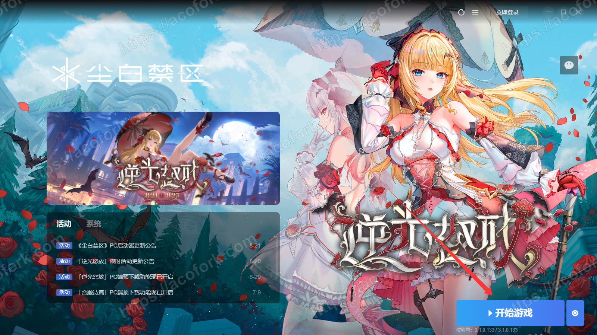

# 确认虚幻引擎版本

导航到放置尘白禁区游戏本体的EXE的目录，如

```bash
C:\SeasunCBJQos\Game\cbjq\game\Game\Binaries\Win64
```

右键 `Game.exe` ，单击属性，转到 `详细信息` 一栏。可以看到是 `UE4 4.26` 。记住他，后文要用

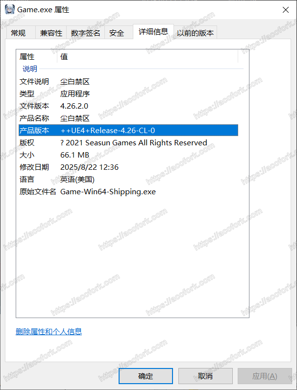

# 将有关CG的PAK文件分离出来

前往

```bash
C:\SeasunCBJQos\Game\cbjq\game\Game\Content\Paks
```

这里列出了所有的PAK文件，由于我们只需要CG图，故也只需要解包类似 `PAK_Game_UI_X-WindowsNoEditor.pak` 这样的文件

将其分离到一个单独的文件夹

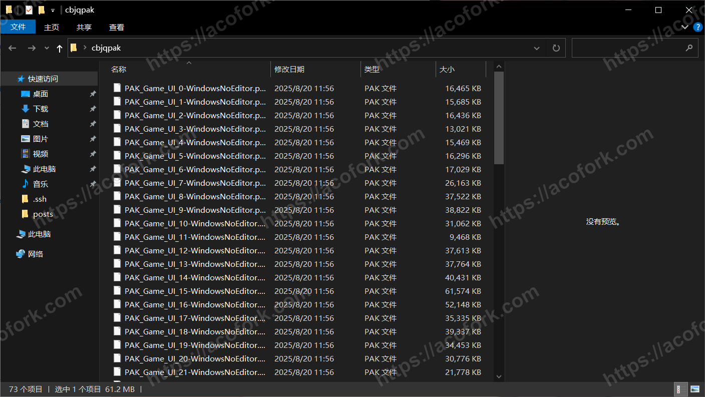

# 解包

下载解包脚本 https://r2.072103.xyz/snowbreak.bms

前往 [Luigi Auriemma](https://aluigi.altervista.org/quickbms.htm) 下载 `QuickBMS` 

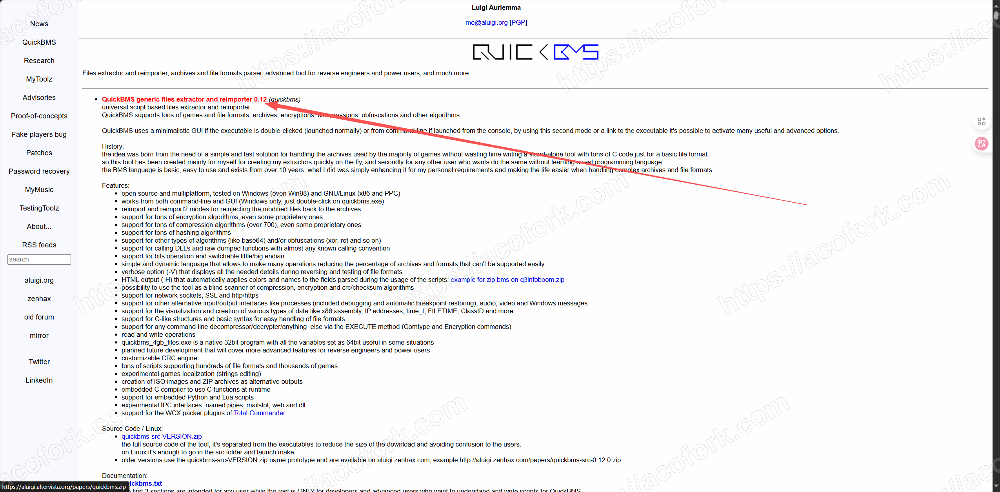

打开 

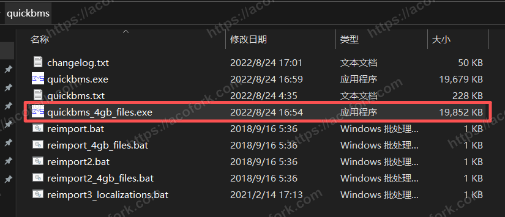

第一步 选择解包脚本

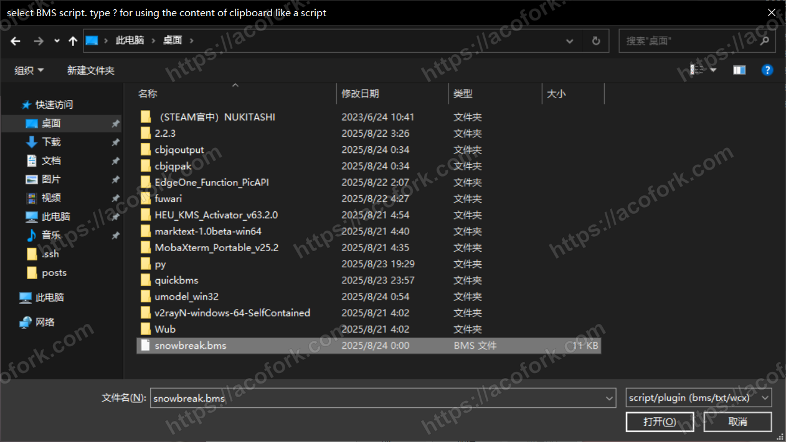

第二步 选择原始PAK文件所在的文件夹。选中文件夹后，在文件名输入 `*` 即可

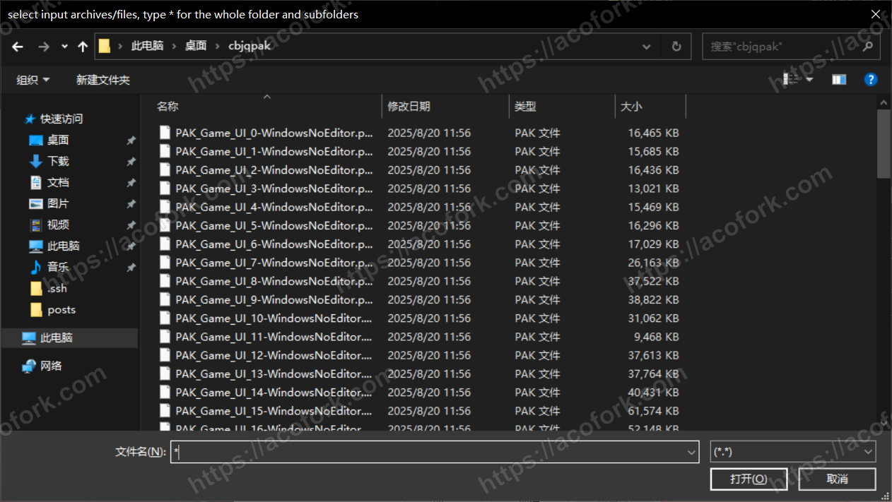

第三步 选择解包后输出目录

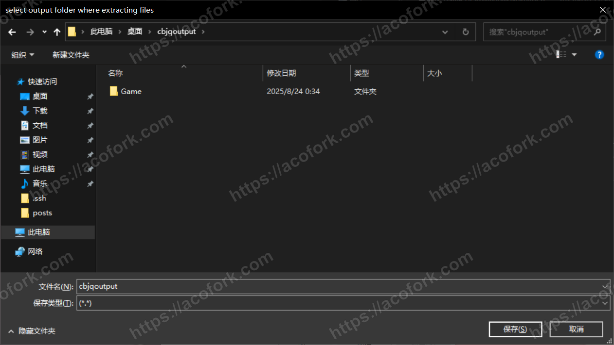

等待解包

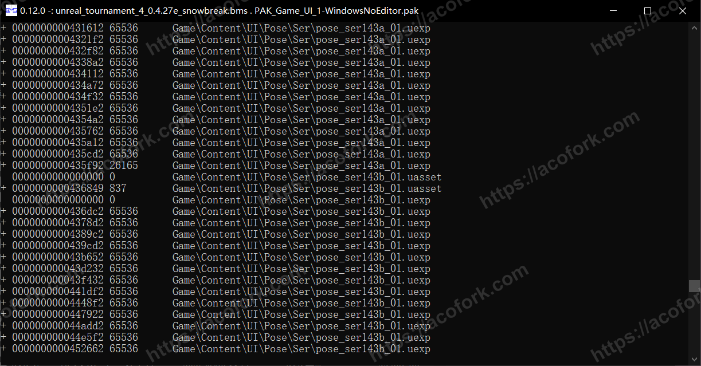

解包完成

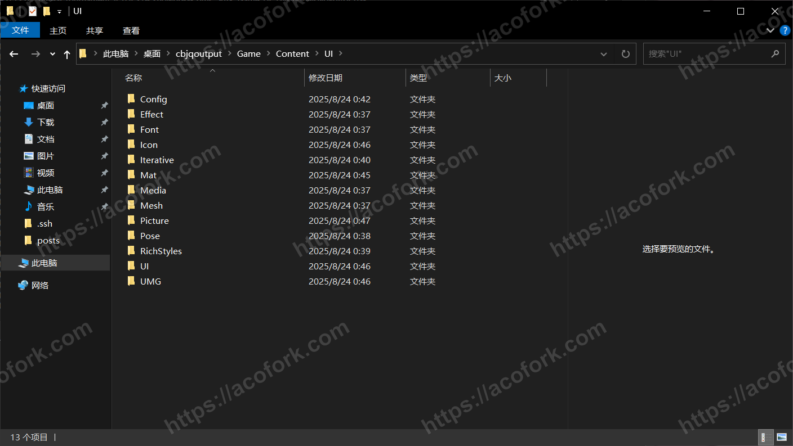

# 查看解包后的文件

解包后我们就得到了一般UE引擎封装的 `.uasset` 文件

我们需要使用另一个工具将其导出为一般格式的文件

前往 [UE Viewer | Gildor's Homepage](https://www.gildor.org/en/projects/umodel#files) 。点击 `Win32 Version` 下载

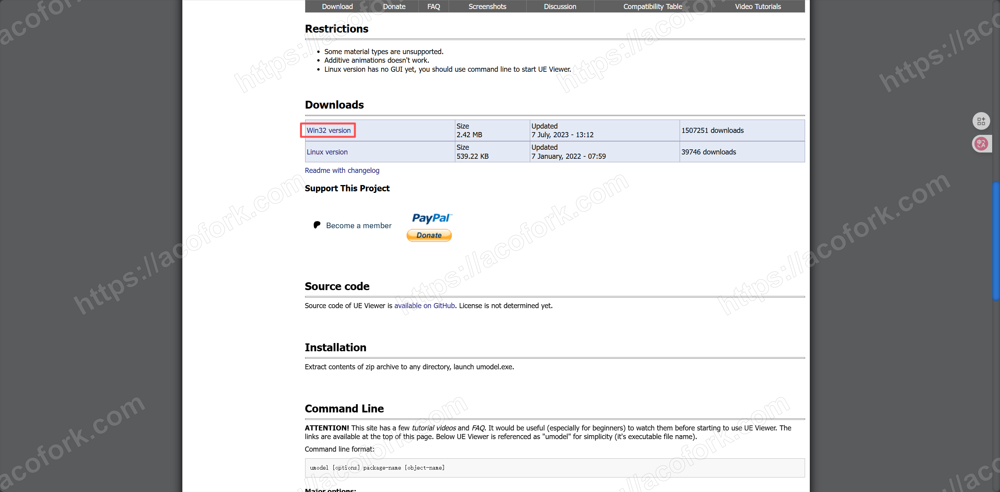

打开 `umodel_64.exe` 。 `Path to game files:` 填写通过 `QuickBMS` 解包后的输出文件夹，勾选 `Override game detection` 并选择 UE4 4.26，也就是最开始我们获取的虚幻引擎版本

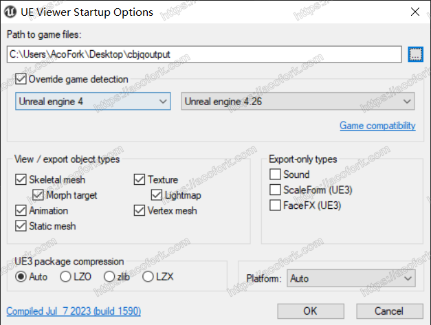

这样就可以在 `UE Viewer` 里面查看 `.uasset` 文件了。但是这个文件浏览器很难用，我推荐导出后使用Windows资源管理器查看

右键你要导出的文件夹，比如 `All Package` 或者 `Game` ，点击 `Export folder content` 。可以选择一下输出文件夹，我这边是默认

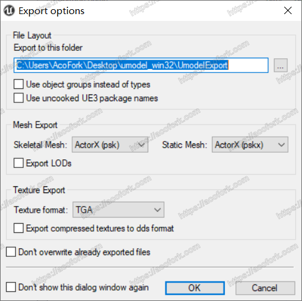

接下来你就可以在你设置的导出文件夹查看到所有一般格式的资源文件了，比如

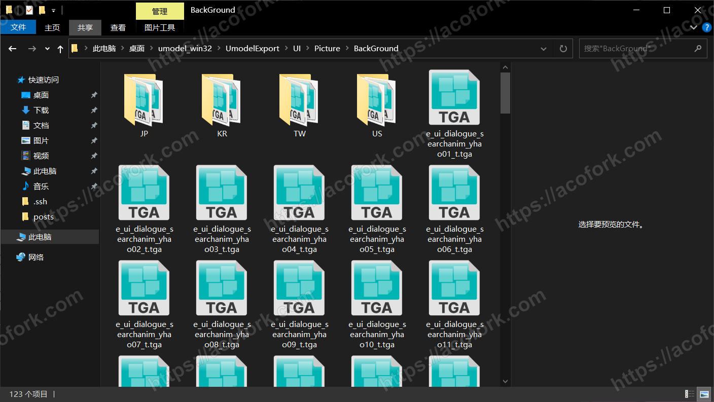

# 获取CG图

全局搜索关键字 `PlotCG` 就可以啦

导出后的图片CG文件为 `.TGA` 文件，是无损图像格式，我们可以通过 [BandiView - 图像查看器、快速且强大](https://www.bandisoft.com/bandiview/) 来查看

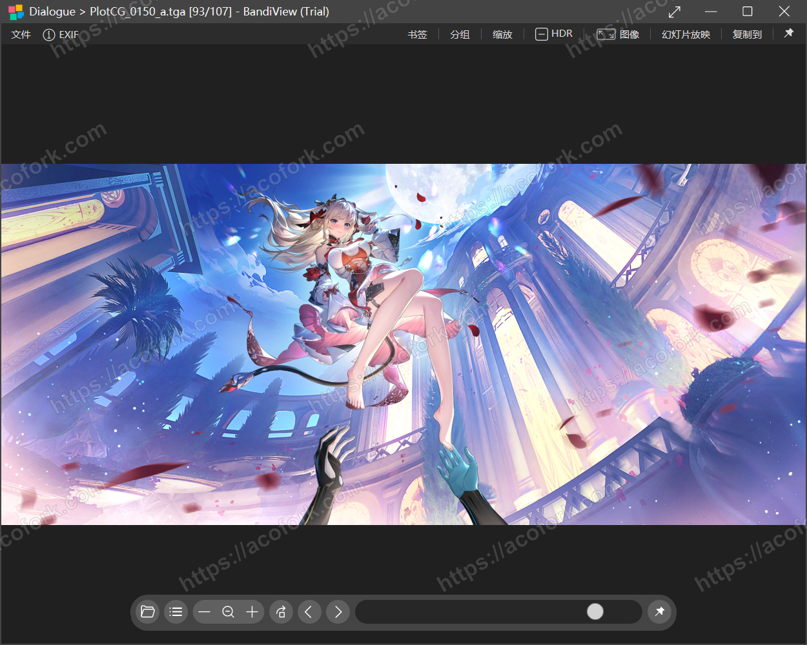
