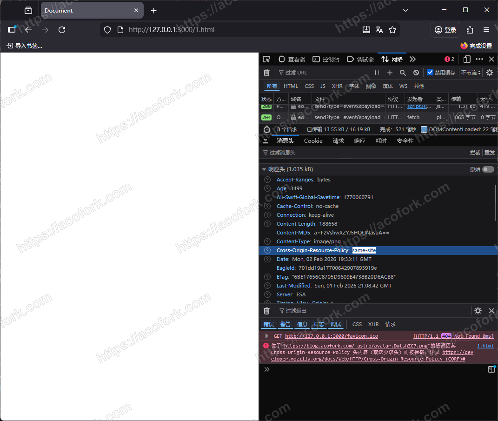
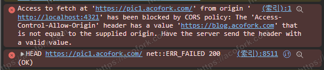

# 正式开始
如果你做过网站（HTML），你就会知道，一个网页除了自身提供内容，如 `
hello world
` ，还可以 **内嵌外链资源** ，如 ``

一方面，HTML允许我们非常自由的引用资源，另一方面，这也会造成一些问题

我们不妨设想一下，你有一个图库站点，里面全都是高清大图，网站访问量也特别高。如果这个时候有人眼红了，也想做一个这样的站点，它可以直接通过HTML做个壳，把品牌改成自己的，然后引用你的图片，这样，它只需要托管很少的文本文件（HTML壳），而无需托管实际图片

那我们肯定不能让他这样，怎么办呢，所以我们需要让我们的图片在被拉取时返回一个 **CORP 响应头**，并且值为 **same-site** ，这样，只要不是你的域名写 `` ，浏览器会统统阻断加载

这就是 **CORP（Cross-Origin Resource Policy） - 跨域资源策略**，它管的是 **资源给不给用** 

|      值       |                    描述                     |
| :----------: | :---------------------------------------: |
| same-origin  |        同源。仅允许 `example.com` 拉取对应资源        |
|  same-site   | 同站。仅允许 `*.example.com` `example.com` 拉取资源 |
| cross-origin |          **默认值**。允许所有源，任何人都可以拉取           |

好的，我们解决了图片被滥用的问题。接下来更棘手的来了，我们还有一个其他网站，不过它并不提供媒体资源，而是在访问的时候获取访客IP

本来这只是你自用的一个网站，但是你发现最近后端的日志有很多乱七八糟的IP，经过一番盘查，你发现有一个网站的底部会显示访客IP，通过F12查看网络请求发现这就是请求的你的网站！

接着你查看了一下这个API返回的响应头，发现你之前为了跨域调用方便设置了 `Access-Control-Allow-Origin: *` ，该头会允许任何人调用你的API并且获取响应

再然后，你将该头的值改为了 `yoursite.com` 这样，就只允许你自己的网站来调用该API了。其他人调用依旧会被浏览器拦截

接着，你又做了个网站，并且为各个地区访问的访客配置了不同的CDN图床，你想让该网站告诉用户您正在使用什么CDN

于是你灵机一动，想到各家CDN返回的响应头 **Server** 的值都不一样，于是就写了一点JS读取响应头并回写到页面上，但是你发现页面上并未显示，并且网络请求是一个奇怪的状态 **200 Failed** 

于是你思考了一下，哦！对了！由于是不同的CDN图床，且主站域名为 `blog.yoursite.com` ，图床域名为 `img.yoursite.com` ，会触发跨域！

虽然你已经经过上次的教训正确设置了 **Access-Control-Allow-Origin** 头，但是对于浏览器来说，你只是允许了别人读取我的响应体，并没有规定响应体，然后你打印了一下JS获取到的所有响应头，你发现只能读到 `Content-Type` 等几个无关响应头，JS根本看不见 **Server** 头

然后你费劲千辛万苦，终于在各大CDN都配置了返回 `Access-Control-Expose-Headers: server` ，然后，你的代码终于工作了！

接着，随着你的网站越做越大，你想给网站添加一个访问量显示模块，但是由于网站本身是静态的，你又不想在全是前端代码的项目里面插后端代码，于是你很聪明，想到了搭建另一个服务，Umami，然后将追踪JS嵌入你的网站，你再通过客户端JS读取Umami的公开页面获取访问量

尽管Umami的公开页面是公开的，但并不是一次请求就能成功，首先你需要先请求一个端点拿到游客token，接着携带这个游客token访问Umami访问量端点，拿到最终的访问量

不过这对你来说都不是什么难事，只需要在JS写好这一整套逻辑再封装一下函数即可

但是实际跑起来的时候又出问题了，由于一个是 `blog.yoursite.com` ，而另一个是 `umami.yoursite.com` ，由于你正确配置了 **Access-Control-Allow-Origin 响应头**，所以第一个请求成功发出，JS也如期拿到了游客token

问题就在第二个请求，你发现你的请求又又又被浏览器拦截了，显示 **请求头: x-umami-share-token 不被对端允许** 

你思考了一下，哦！尽管我们配置了 **Access-Control-Allow-Origin 响应头** ，但也只是允许获取响应体，浏览器对于 **发请求头** ，需要在Umami再配置一条 **Access-Control-Allow-Headers 响应头** 

接着，你配置了该响应头，为了方便，你直接写了 `Access-Control-Allow-Headers: *` ，终于，你的代码成功工作了，也拿到了正确的访问量

这就是 **CORS（Cross-Origin Resource Sharing）- 跨域资源共享** ，它管的是 **API给不给调，只能给谁调** 

- Access-Control-Allow-Origin（谁能跨域访问资源？**默认谁都不能**）

|值|描述|
|:-:|:-:|
|`*`|允许**任意源**访问资源（⚠️ 不能与 `Allow-Credentials: true` 同时使用）|
|`https://example.com`|仅允许**指定源**访问资源|
|`null`|允许 `Origin: null`（如 `file://`、沙盒 iframe）|
- Access-Control-Allow-Methods（跨域访问允许的请求方式？**默认都不允许**）

|值|描述|
|:-:|:-:|
|`GET`|允许 GET 请求|
|`POST`|允许 POST 请求|
|`PUT`|允许 PUT 请求|
|`DELETE`|允许 DELETE 请求|
|`PATCH`|允许 PATCH 请求|
|`OPTIONS`|允许预检请求|
|`GET, POST, OPTIONS`|允许多个方法（逗号分隔）|

- Access-Control-Allow-Headers（跨域访问允许带的请求头？**默认只允许带 [列入 CORS 白名单的请求标头 - MDN Web 文档术语表：Web 相关术语的定义 | MDN](https://developer.mozilla.org/zh-CN/docs/Glossary/CORS-safelisted_request_header)** ）

|值|描述|
|:-:|:-:|
|`Content-Type`|允许携带 `Content-Type` 请求头|
|`Authorization`|允许携带认证头|
|`X-Custom-Header`|允许指定的自定义请求头|
|`*`|允许**所有请求头**（现代浏览器支持，主要用于非凭据请求）|
- Access-Control-Allow-Credentials（跨域访问是否允许携带凭据？**默认不允许** ）

|值|描述|
|:-:|:-:|
|`true`|允许携带凭据（Cookie / Authorization / TLS client cert）|
|（不返回）|**默认**不允许携带凭据|

- Access-Control-Expose-Headers（跨域访问时能读到的响应头？**默认只能读到 [列入 CORS 白名单的响应标头 - MDN Web 文档术语表：Web 相关术语的定义 | MDN](https://developer.mozilla.org/zh-CN/docs/Glossary/CORS-safelisted_response_header)** 

|        值         |      描述       |
| :--------------: | :-----------: |
|  `X-Request-Id`  | 允许 JS 读取该响应头  |
| `Content-Length` | 允许 JS 读取内容长度  |
|    `X-A, X-B`    | 暴露多个响应头（逗号分隔） |
- Access-Control-Max-Age（跨域访问时预检请求结果缓存多长时间（秒）？ **默认不缓存** ）

|    值    |         描述         |
| :-----: | :----------------: |
|   `0`   |      不缓存预检请求       |
|  `600`  |    预检结果缓存 10 分钟    |
| `86400` | 缓存 24 小时（浏览器可能有上限） |

而对于 **COOP和COEP** ，他们都是配在 **用户正在访问的HTML上面** ，分别用于以下情况

-  Cross-Origin-Opener-Policy（COOP）

**COOP（Cross-Origin Opener Policy）** 是一种浏览器安全机制，用于控制**不同页面之间是否可以共享同一个浏览器窗口上下文（browsing context）**。它主要影响页面与通过 `window.open()` 打开的其他页面之间的关系，以及这些页面是否能够互相访问 `window.opener`。

当页面启用 COOP 后，浏览器会根据策略将跨源页面强制隔离到不同的浏览器进程中，使它们无法共享执行环境。这种隔离可以有效降低侧信道攻击（如 Spectre）的风险，同时防止跨站页面通过 `window.opener` 进行劫持或信息泄露。

COOP 关注的是**页面与页面之间的隔离关系**，并不参与资源（如图片、脚本、视频）的加载或校验。

| 值                          | 是否默认 | 行为描述           | 主要影响                                       |
| -------------------------- | ---- | -------------- | ------------------------------------------ |
| `unsafe-none`              | ✅ 是  | 不启用任何隔离        | 跨源页面可共享 browsing context 与 `window.opener` |
| `same-origin`              | ❌    | 仅允许同源页面共享窗口与进程 | 跨源 `window.opener` 被置为 `null`，强制进程隔离       |
| `same-origin-allow-popups` | ❌    | 自身隔离，但允许弹出窗口   | 常用于 OAuth / 支付弹窗场景                         |

-  Cross-Origin-Embedder-Policy（COEP）

**COEP（Cross-Origin Embedder Policy）** 是一种用于限制页面**如何加载和使用跨源资源**的安全策略。当页面启用 COEP 后，所有被嵌入的跨源资源都必须明确表态“允许被使用”，否则浏览器会阻止这些资源被页面消费。

COEP 的核心目标是确保页面不会在不知情的情况下加载不受信任的跨源资源，从而避免利用共享进程或共享内存进行的攻击。它通常与资源侧声明（如 CORS 或 Cross-Origin-Resource-Policy）配合使用。

COEP 并不会阻止浏览器发起网络请求，但会在资源返回后决定该资源是否可以被页面使用。

|值|是否默认|行为描述|主要影响|
|---|---|---|---|
|`unsafe-none`|✅ 是|不启用嵌入限制|页面可加载任意跨源资源|
|`require-corp`|❌|仅允许明确授权的跨源资源|跨源资源必须满足 CORP 或 CORS|

---

### 什么时候浏览器才会检查 COOP 和 COEP？

这两个标头**只有在页面被作为“文档（document）加载”时才会被浏览器检查**，通常包括：

- 顶级页面导航（在地址栏中直接打开页面）
    
- iframe 中加载的文档页面
    
- 弹出窗口（`window.open()` 打开的页面）
    

对于图片、音频、视频、脚本等**非文档资源**，浏览器不会检查其响应中的 COOP 或 COEP 标头，这些资源即使返回 200 OK，也不会因此自动获得跨源使用权限。

需要注意的是：

- **COOP** 在页面创建或连接 browsing context 时生效，用于决定页面之间是否可以共享窗口和进程。
    
- **COEP** 在页面尝试使用嵌入资源时生效，用于判断跨源资源是否满足安全要求。
    

---

### COOP 与 COEP 的联合效果

当一个页面同时启用了 COOP 和 COEP，并且所有嵌入资源都满足对应要求时，浏览器会将该页面视为**跨源隔离（cross-origin isolated）**状态。在这种状态下，页面可以安全地使用一些高权限 Web API，例如 `SharedArrayBuffer` 和高精度计时器。

# 浏览器安全模型完整流程图

