# 引言
接简介

这个时候我们实际上是需要将那个错误提交的文件在所有Git提交上抹掉，并且逻辑自洽

当然，如果你不嫌麻烦或者仓库提交本来就很少，你可以一点点的手动重写Git提交历史。又或是将历史提交合并为一个提交，强制推送

但是，这些方法要不太磨人，要不不优雅

假设这个仓库有1000+提交又不想合并所有提交历史呢？

# 正式开始

有个PIP包正好可以满足我们的需求， **git-filter-repo** 

```bash
pip install git-filter-repo
```

安装后，进入你的Git仓库运行，接下来，我们只需要传一个文件路径给它即可

- **--path** 是传入的文件路径，可以是相对路径也可以是绝对路径。但是注意，要用 **/** 分割路径
- **--force** 是让它忽略安全性条件（如必须是一个刚克隆的仓库）
- **--invert-paths** 是反选路径，也就是 **剔除** 指定 **--path** 的文件

执行后它会查找该文件所在仓库的所有提交，并仅将该文件剔除，若某一提交中仅对该文件做了更改，则一整条提交直接消失（因为提交中无文件更改）；若某一提交中除了对该文件做了更改，还有其他文件，则该条提交仍然存在，但是文件变更记录中不再有该文件

```bash
git-filter-repo --force --path src/secret.txt --invert-paths
```

比如这里我们一不小心提交了个 **微信密码** 

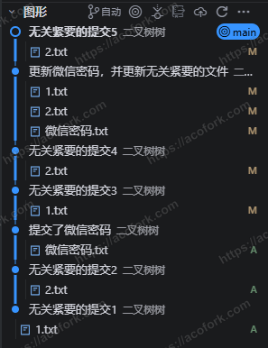

我们可以用该命令将其 **剔除** 

```bash
git-filter-repo --force --path 微信密码.txt --invert-paths
```


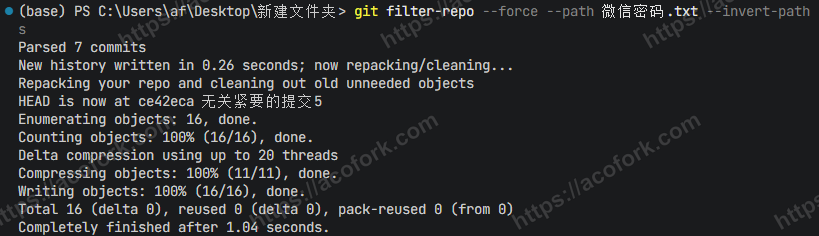

可以看到，效果非常拔群， **微信密码.txt** 已经不翼而飞了

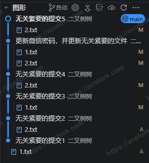

但是还有个问题，就是我们曾经的 **提交文本** 暴露了 **我们曾经曾上传过微信密码相关的文件** ，虽然实际上文件已经被剔除了

那有没有办法把这条提交删掉呢？有的，兄弟有的

我们可以使用原生的 **git rebase** ，以该提交作为 **基点** ，将后续提交接在该提交上，这样就可以 **架空** 该提交。宏观来看，我们就在Git仓库中从 **中间** 删除了一条提交

首先，我们需要获取该提交的 **哈希** ，这里假设为 **4e19d1fc6af5119cb33128a92d5d4e80fc42e6ef** （仅需前8位即可）

接下来，使用变基命令

```bash
git rebase --onto 4e19d1fc^ 4e19d1fc
```

这里会报错并自动中断变基进程，Git表示该提交有些文件和当前的提交冲突，无法自动解决冲突

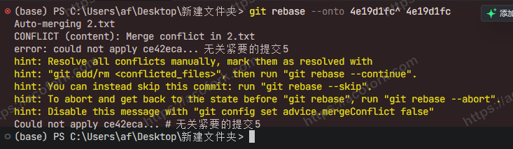

由于我们要以当前提交为准，仅剔除中间的提交，所以我们使用该命令 **以当前提交为基准，解决所有文件的冲突** 

```bash
git checkout --theirs .
```

接下来将冲突标记为 **已解决** 
```bash
git add -A
```

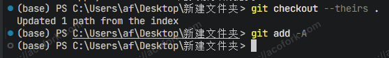

继续变基进程

```bash
git rebase --continue
```

这里会弹出一个修改Git提交的vim，直接关掉即可。 **ESC** + **\:q** 

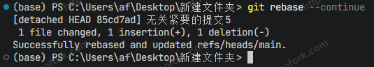

如果中途又停下来重复上面几步即可。最终，检查你的本地提交，确认要删除的提交已经不再存在。并且目前工作区的文件没有任何更改，仅更改了Git历史提交记录

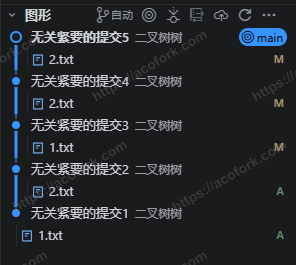

最后，我们需要将本地仓库 **覆写** 到远程仓库，由于最开始的PIP包在命令执行完毕后会将远程仓库删除，我们此时需要重新添加回来

```bash
git remote add origin https://github.com/你的用户名/你的仓库名.git
```

建立upstream并强制推送到远端

```bash
git push -u origin main -f
```

此时，大功告成。自此时起，所有用户都已经看不到那个你不想让别人看到的文件与提交记录了，就像它从未存在过

*真的吗？*

如果说，有些人仍留存着你仓库提交的完整 **commit id** ，那他们可以通过该链接访问到那个你想隐藏的提交，只不过Github会弹出警告： **This commit does not belong to any branch on this repository, and may belong to a fork outside of the repository.（此提交不属于此仓库的任何分支，可能属于仓库外的某个分支副本。）** 
```bash
https://github.com/{user}/{repo}/commit/{commit id}
```

如果想完全从Github上删除，你需要向Github提交支持工单： [GitHub 支持](https://support.github.com/)

点击我的工单

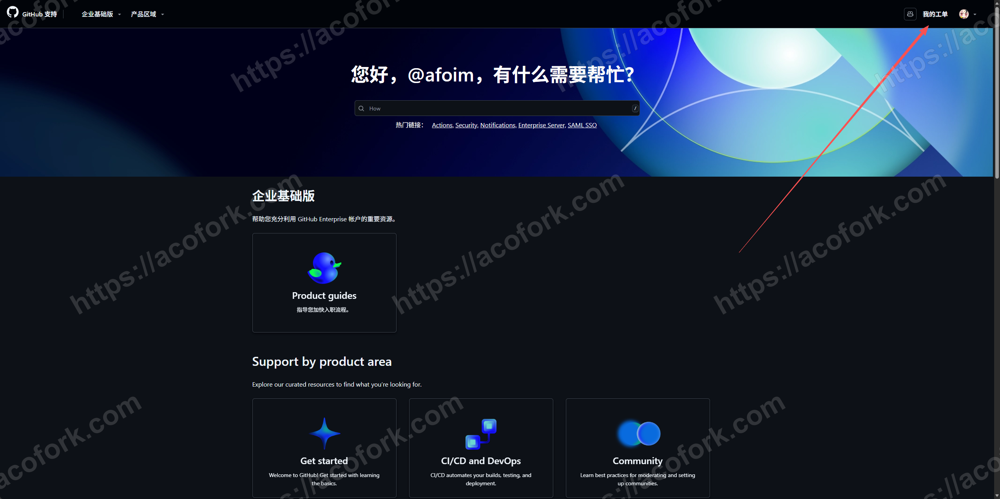

新工单

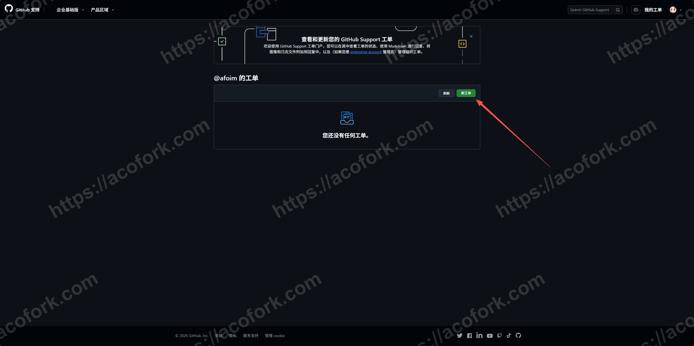

从我拥有或控制的存储库中删除数据

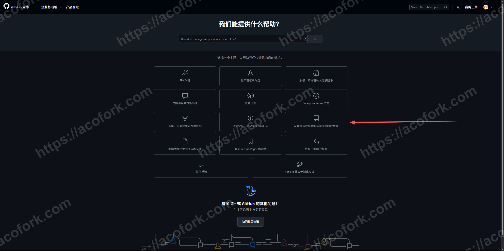

删除其他数据

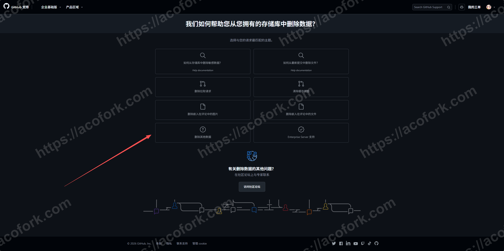

接下来填写工单，你可以参考我的主题与正文（生成与 OpenAI ChatGPT 5.2）

```bash
Title:Request to Remove an Orphaned Commit URL Containing Sensitive Information

Hello GitHub Support Team,

I am writing to request the removal of the following commit page from GitHub’s website:

https://github.com/{user}/{repo}/commit/{commit id}

This commit has already been removed from my local repository history and I have force-pushed the updated history to the GitHub remote repository. As a result, the commit is now orphaned and no longer reachable from any branch or tag.

However, the commit page itself is still accessible via its direct URL. Unfortunately, this commit contained sensitive information, and I would like to request that GitHub remove this URL from the website to prevent further access.

Please let me know if you need any additional information or verification from my side to proceed with this request.

Thank you very much for your time and assistance.

Best regards,  
{user}
```

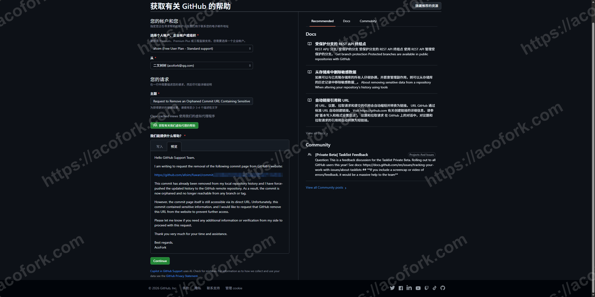

最后点击 **Continue** ，新版工单系统会自动使用Copilot为你生成一些帮助信息，等他BB完，我们继续创建即可

马上，你就会收到一封来自Github的邮件，表示Github已经收到您的工单。耐心等待Github的下一步回复即可


Update...

Github支持在12分钟后就删除了相关内容，这真的很高效

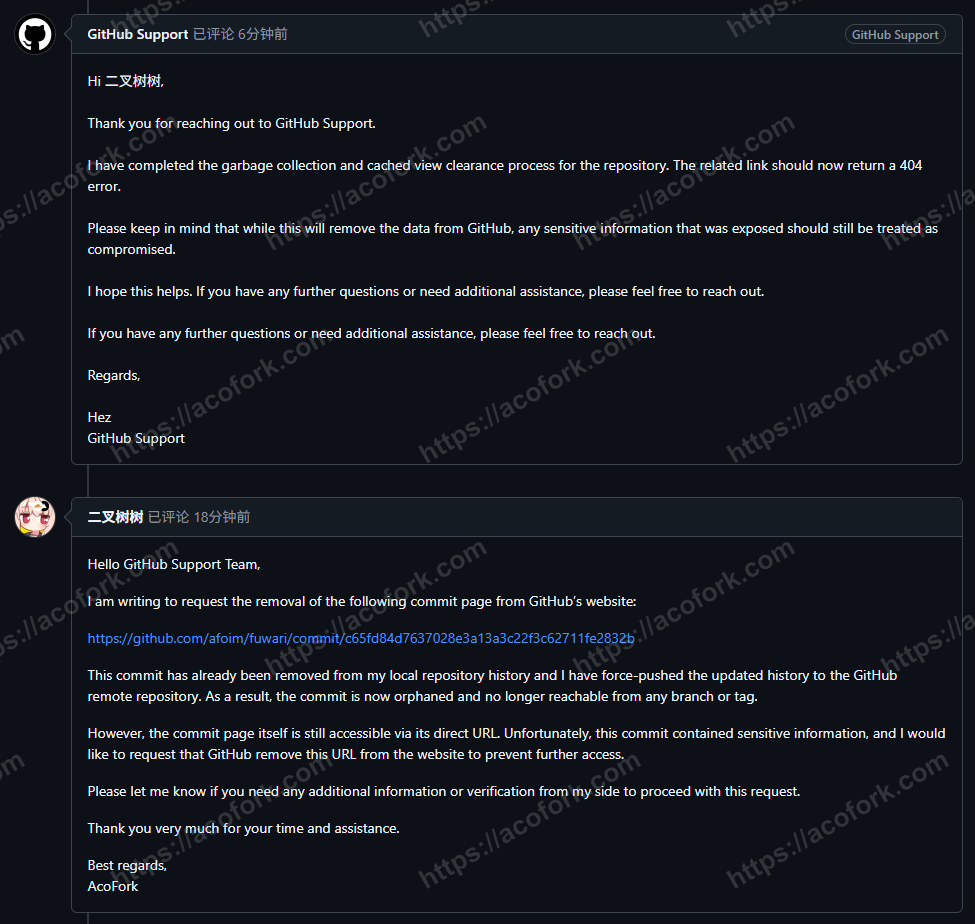