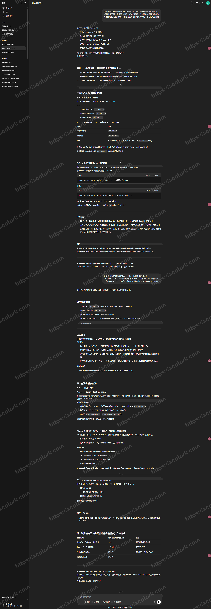
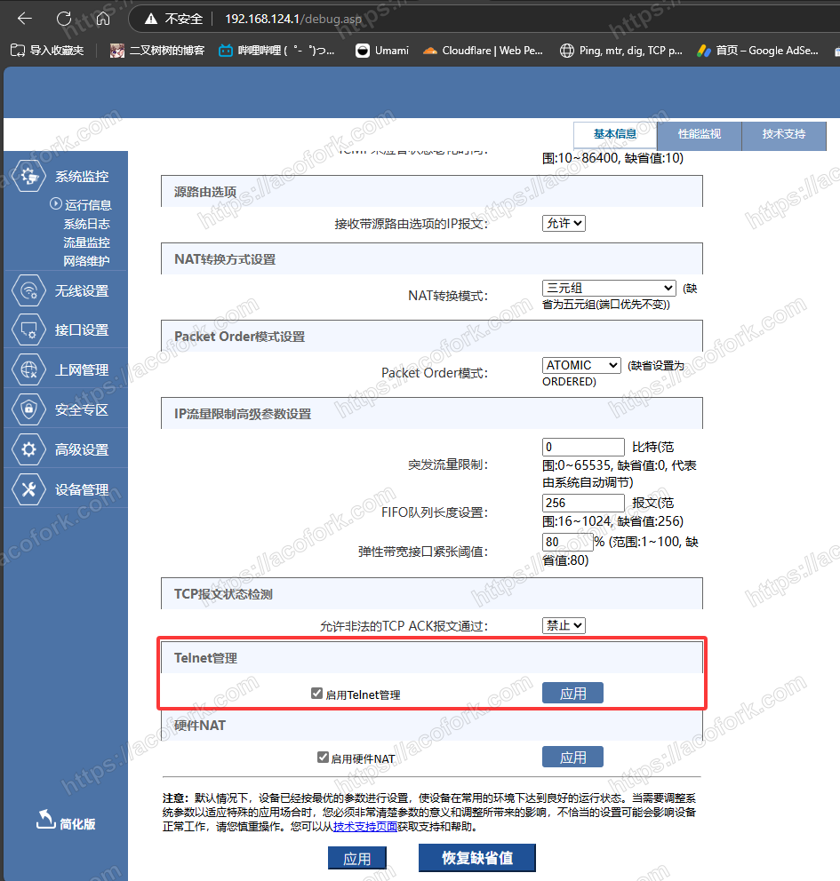
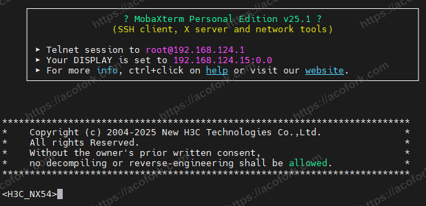
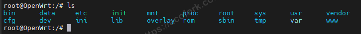
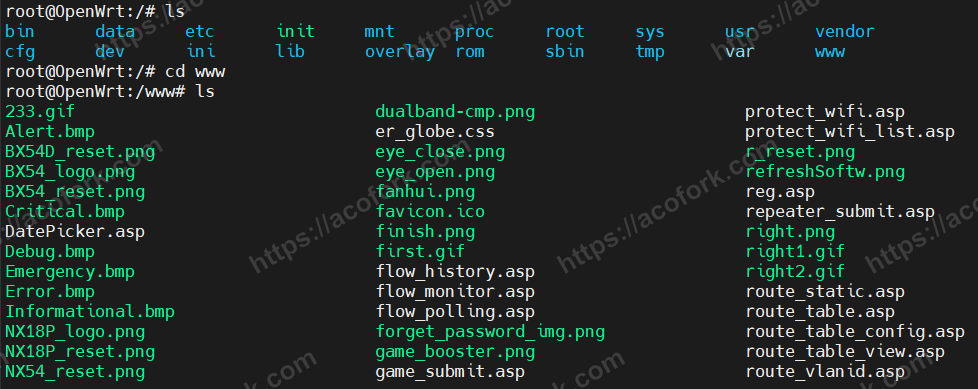
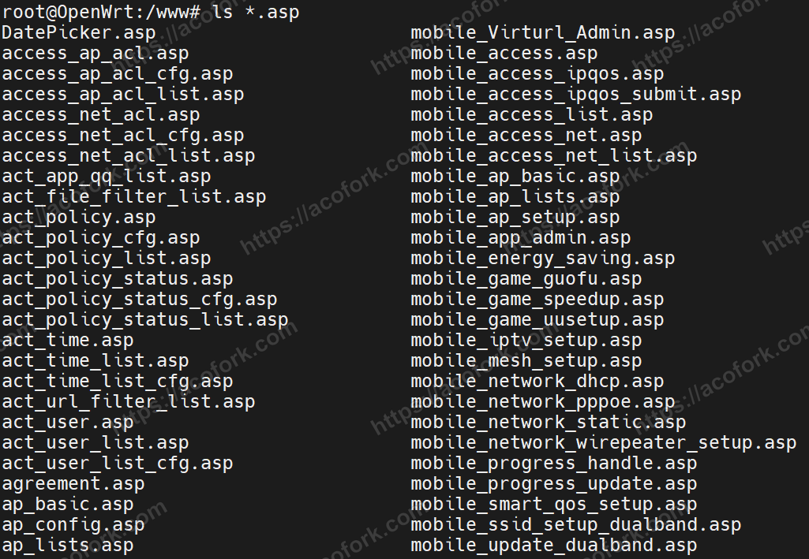
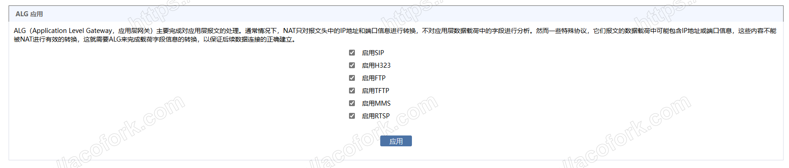

# 前情提要

起因是我经常使用的Cloudflare梯子访问速度变慢，而且经常被RST重置。买了个小鸡后自己搭了个Reality的梯子还是经常掉线，甚至HTTP协议的面板访问都超时。于是我便开始鼓捣起路由器


### 小插曲 - 光猫桥接的坏处

在我研究的时候，咔，突然就上不了网了，往H3C路由器后台一看，发现PPPoE拨号显示服务器无响应

我思考了一下，我现在的网络架构是光猫桥接，路由器拨号，现在路由器拨号显示服务器无响应。暂时还不知道是什么问题，最好的方法是去光猫后台看看

然后我就在浏览器输入 `192.168.1.1` 然后看着他转啊转，转啊转，然后连接超时

我又一想，对啊，光猫桥接路由拨号那么路由器必然不在光猫管理后台的网段，自然也就没法通过路由器的WiFi进入光猫的后台（后面发现并非如此）

然后我就又思考，我记得光猫是开启了WiFi的，一找还真有，连一下，忘记密码了，试了好几遍也不行

那么既然暂时连不上光猫的WiFi，那我就物理接触一下光猫吧🤔

一看时间，哟，凌晨1点，光猫在隔壁房间，还有人睡觉呢，那看来这个法子也行不通

暴力破解一下吧，算了一下，哪怕是4位数字排列组合也有78,074,896种可能，而且对面光猫也不会秒响应，至少要等个3秒，那么算下来就是我最差需要花费234,224,688秒，也就是3,903,744.8分钟，65,062.41333333333小时，2,710.933888888889天。额...算了吧

继续思考，既然光猫和路由器是物理连接上的，那么我改改路由器的设置是不是能连上光猫呢？

我觉得行得通，但是问了AI，给我扯了一堆乱七八糟的结果是行不通（其实行得通）



然后就是乱七八糟的尝试。终于我发现，**将路由器改为静态IP模式，将IP改为192.168.1.2，网关改为192.168.1.1的时候，成功进入了192.168.1.1，也就是光猫的后台**

然后一查看，PON链路连接状态：未连接


这一般是光纤松了，但是我现在也摸不到光猫啊

思考到这的我决定睡觉吧，睡一觉就好了

结果2小时后它自己好了...


插曲 End

# 行动一：通过Telnet登录路由器

其实我早就知道这个H3C路由器可以打开Telnet并且登录进去过知道它是OpenWRT，但是因为这个机子不能刷机，而且OpenWRT版本在15.05.1（在2025-05-02，最新稳定版的OpenWRT版本为24.10.0）😅

姑且说一下H3C家用终端怎么开Telnet吧

进入下述网址，你就能看到Telnet开关，打开即可

```bash
https://192.168.124.1/debug.asp
```



顺带一提

NAT转换方式为三元组最开放。其他看不懂的东西建议不要动

接着就是通过Telnet登录路由器了

H3C的Telnet端口为15000，登录进去后是这样



这个界面下我也不知道有啥能操作的，接着输入 `debugshell` 进入OpenWRT系统（当成没有包管理器的Linux用就行[因为这系统太老了 opkg找不到任何软件源，啥也装不了😅]）


这下看懂了

# 行动二：找隐藏页面

既然有 `debug.asp` 那是不是还有更多隐藏的页面呢

首先看看这个系统里面都有啥



发现了 `www` 目录，进入看看



看来这就是供用户访问的Web服务的源，但这里还有很多静态文件（比如CSS，PNG），我们筛选一下 `.asp` 文件



挨个访问看看，有不少隐藏的页面




# 行动三：瞎JB乱改

找到感觉影响了数据传输性能的设置，比如什么防火墙、QOS、数据队列等等的乱改一通，防火墙关，QOS关，数据队列顺序优先，NAT类型FullCone，防攻击关闭等等等等

# 最终行动：再次测试

似乎好了？我不知道，等白天再测测吧，也可能是心理作用


# 建议

家用路由器别买H3C😅
