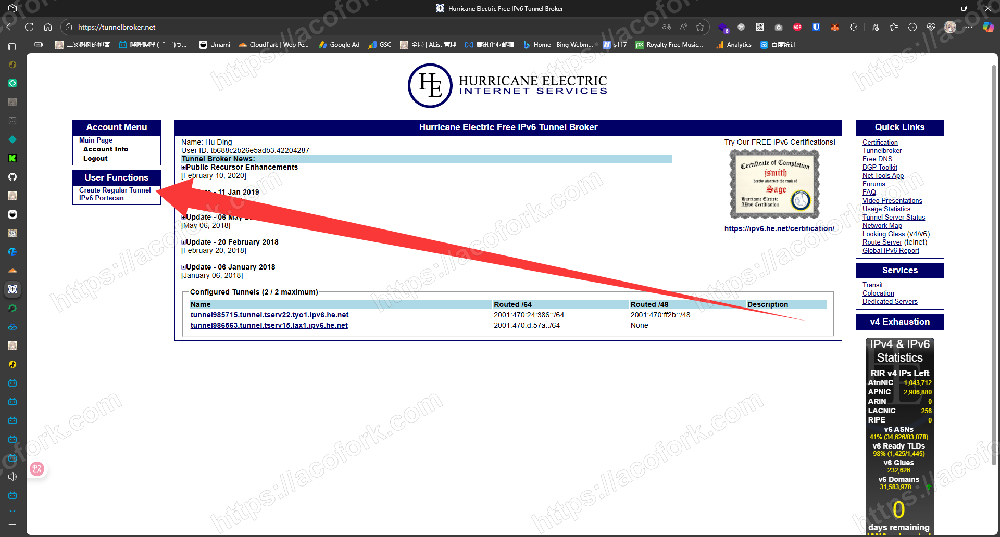
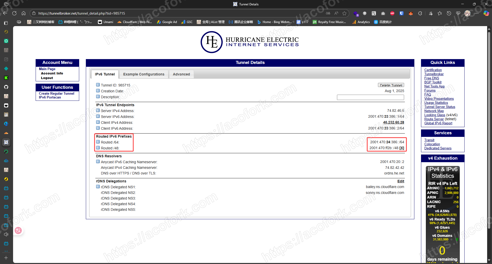
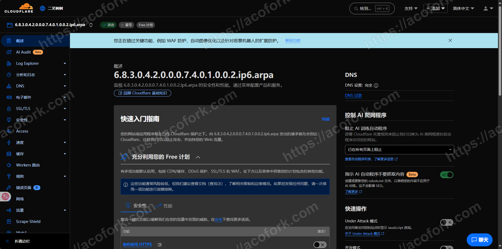
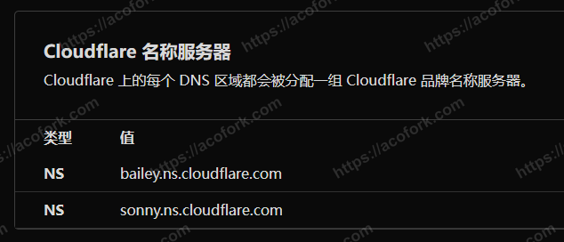
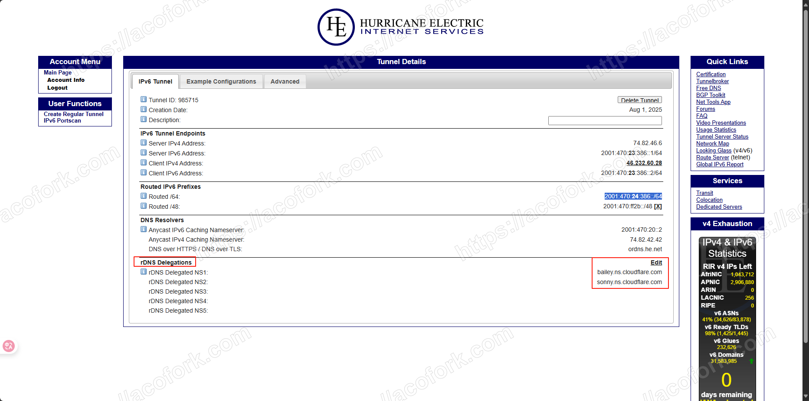
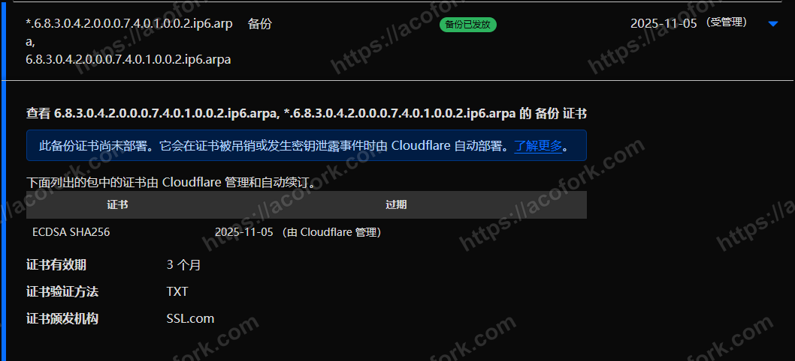

# 这是什么

> 以下内容来自GPT-5

这是一个 **IPv6 反向解析（Reverse DNS）域名**，遵循 `ip6.arpa` 格式。  
它是把 IPv6 地址每个十六进制数字倒序排列，加上 `.ip6.arpa` 后缀，用于 DNS 反查时将域名解析回原 IPv6 地址。

# 将 x.x.x.x.x.x.x.x.x.x.x.x.ip6.arpa 弄到手

> 视频教程： https://www.bilibili.com/video/BV1q8tBzsEPi/

前往 [Hurricane Electric Free IPv6 Tunnel Broker](https://tunnelbroker.net/)

注册一个账号（需要用域名邮箱）

创建隧道。需要一台启用了ICMP信令的VPS

填上IP后，TunnelBroker会向其发送Ping请求

如果TunnelBroker收到了回应，并且该IP没有被其他隧道绑定，就会弹出绿色，可绑定的标志

如果该IP曾被绑定，则需要进行HTTP验证



进入这个页面，查看TunnelBroker为你分配的路由IPv6



以 `2001:470:24:386::/64` 为例

首先加0，每项4位，通过 `:` 分割，则为 `2001047000240386`

然后倒过来，则为 `6830420007401002` 

最后，加上 `.` 和 `.ip6.arpa` ，则为 `6.8.3.0.4.2.0.0.0.7.4.0.1.0.0.2.ip6.arpa` 

将其添加到Cloudflare



查看Cloudflare要求你设置的NS服务器



回到TunnelBroker进行设置



等待域被激活即可

# 为其签发SSL

默认 ipra 无法签发SSL，因为会被大部分SSL提供商拒签

将Cloudflare SSL提供商改为 SSL.COM 可以解决这个问题

获取必要信息，发起更改SSL提供商请求

```bash
curl --location --request PATCH 'https://api.cloudflare.com/client/v4/zones/<zone_id>/ssl/universal/settings' --header 'X-Auth-Email: 你的CF注册邮箱' --header 'X-Auth-Key: 你的CF全局APIKey' --header 'Content-Type: application/json' --data-raw '{"enabled":true,"certificate_authority":"ssl_com"}'
```

稍等片刻，CF会自动使用新的SSL提供商签发SSL



# 局限性

本人测试，如果您自己创建SSL.COM的账户尝试签发SSL会拒签。故该域名仅能在Cloudflare CDN下使用
