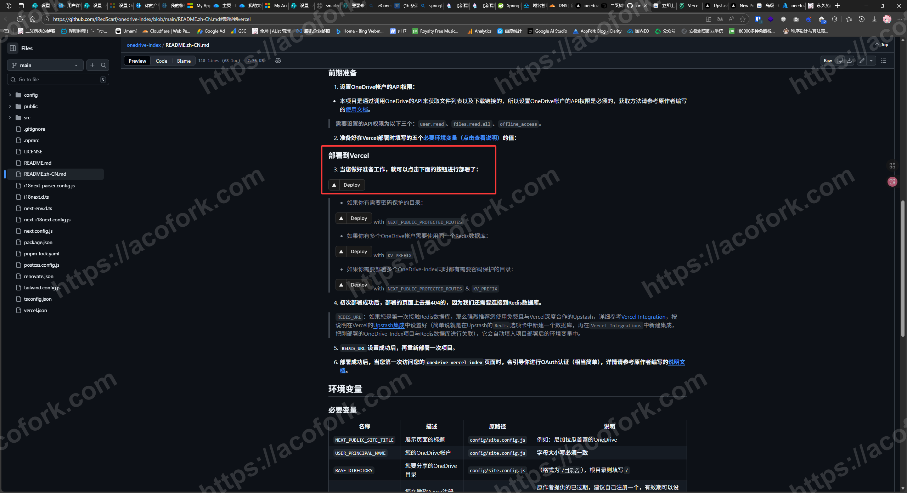
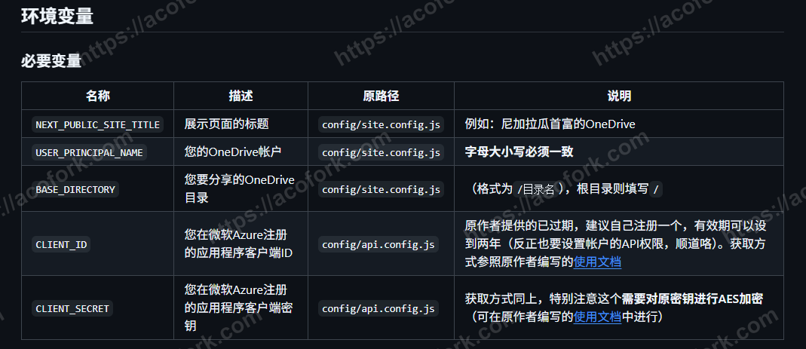
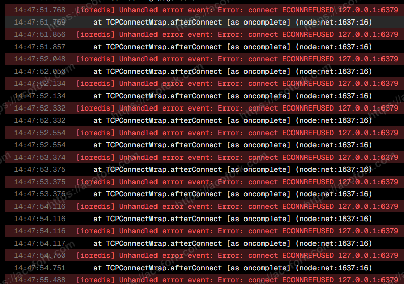
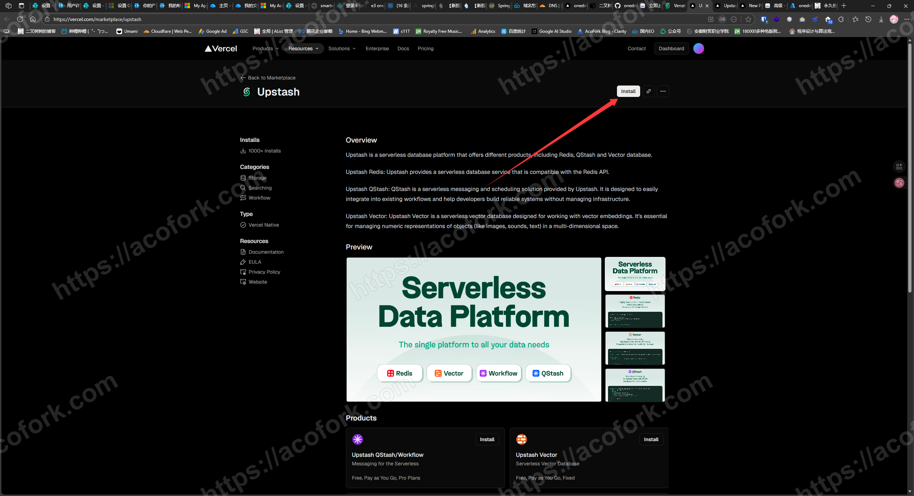
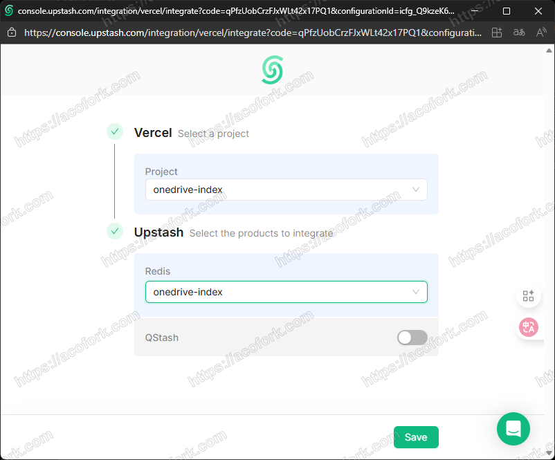
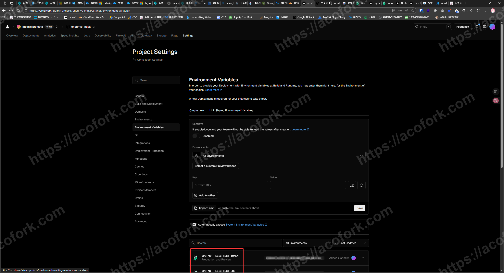
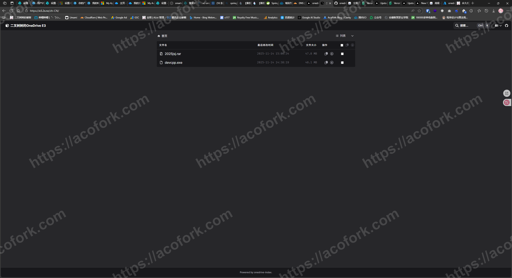

# 正式开始
你可以根据[前文](/posts/ms-e3/)免费拿E3，得到至高免费5T的OneDrive存储空间，也可以用你个人永久免费的5G空间，都可以！

前往 [高级 - OneDrive Vercel Index](https://ovi.swo.moe/zh/docs/advanced#%E4%BD%BF%E7%94%A8%E4%BD%A0%E8%87%AA%E5%B7%B1%E7%9A%84-client-id-%E4%B8%8E-secret) 拿到 clientid 和 secret

前往该页面，点击快速部署 [onedrive-index/README.zh-CN.md at main · iRedScarf/onedrive-index](https://github.com/iRedScarf/onedrive-index/blob/main/README.zh-CN.md#%E9%83%A8%E7%BD%B2%E5%88%B0vercel) 

填写必须的5个环境变量

其中，USER_PRINCIPAL_NAME为类似 huding@Smartree233.onmicrosoft.com 的电子邮箱，也就是你登陆OneDrive的用户名

Vercel部署完毕后，会报错连不上Redis，因为我们还没创建和绑定，现在我们开始做

前往 https://vercel.com/integrations/upstash 点击 Install

选择你要绑定的Vercel项目，并且设置Redis实例名称

来到Vercel的环境变量页面，这就是绑定成功了

随便打开一个部署，点击 Redeploy 重新部署，就能成功连接数据库了

接下来访问你的项目域名，进入OneDrive-Index的引导，需要打开微软的一个链接授权

授权后会重定向到一个localhost的域名，复制该URI，粘贴回OneDrive-Index即可（仅需一次）

成功部署！
