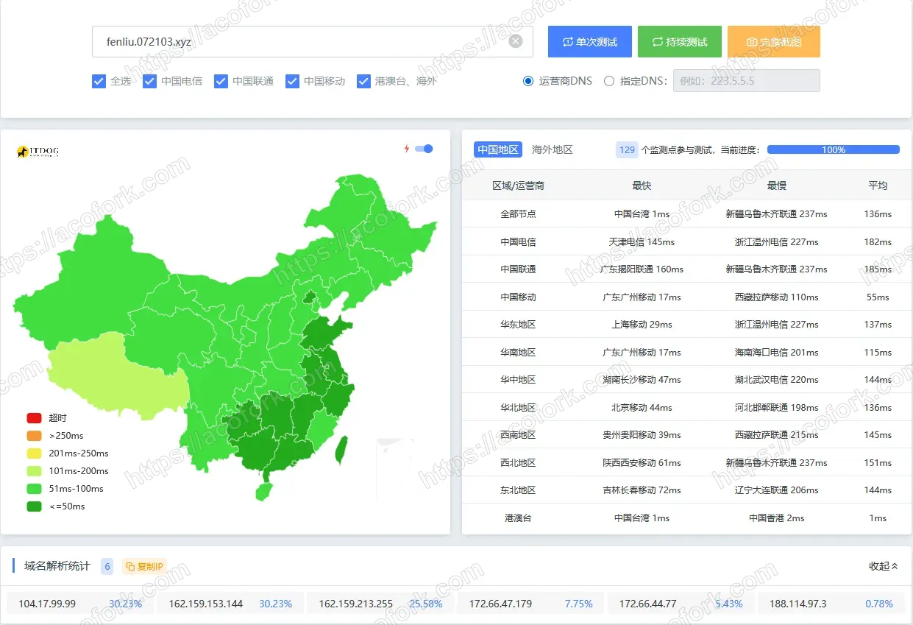
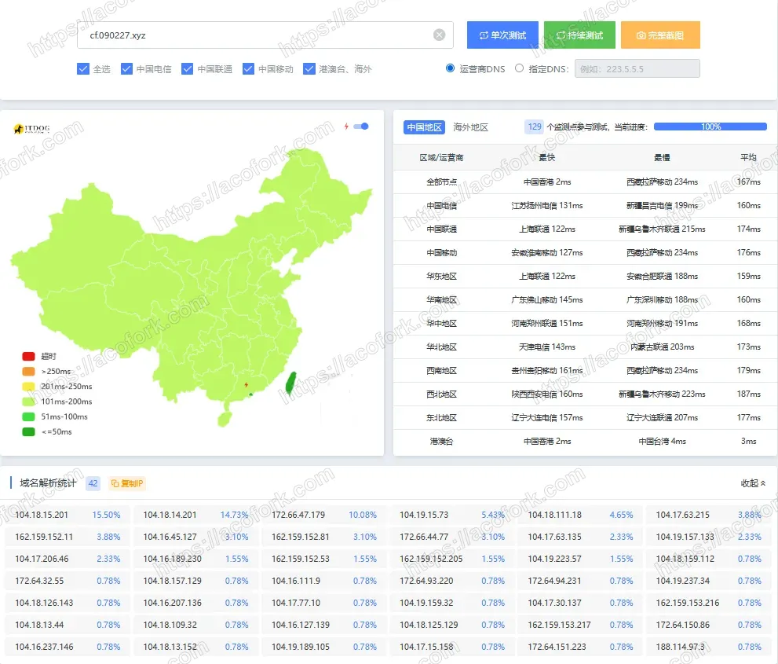
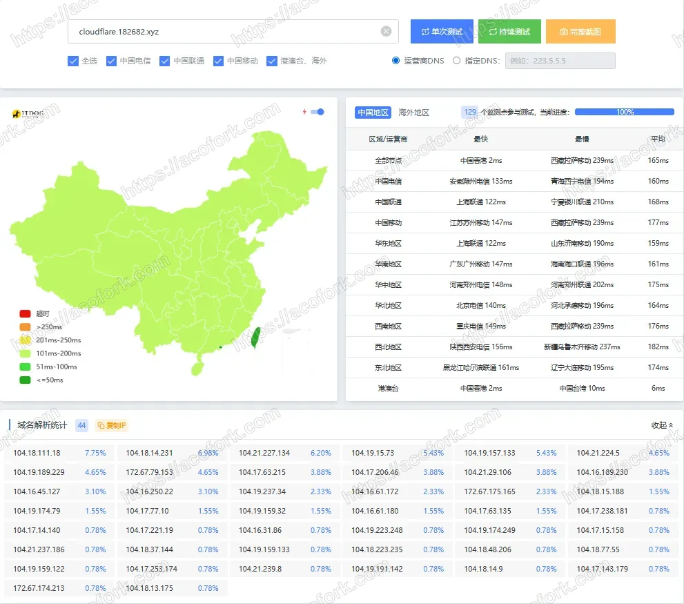

# zt重置设备ID

在 ZeroTier 中，如果你通过克隆 VM 或复制系统镜像导致 设备 ID（Node ID）重复，需要重置设备 ID。ZeroTier 的设备 ID 是基于本机生成的私钥，无法在软件内直接修改，但可以通过以下方法重置：

方法 1：在 Linux / Debian 上重置

停止 ZeroTier 服务：

```shell
sudo systemctl stop zerotier-one
```

删除本地身份文件（Node ID）：

```shell
sudo rm -rf /var/lib/zerotier-one/identity.*
```

注意：identity.* 文件包含你的 Node ID，如果删除，ZeroTier 会生成新的 Node ID。

启动 ZeroTier 服务：

```shell
sudo systemctl start zerotier-one
```

# r2.py所需依赖

```shell
pip install keyboard pyperclip pillow boto3 pyautogui
```

# ShellClash

> 用于在Linux上使用CLI来进行正向代理。通过导入标准的Clash `config.yaml` 来实现

https://github.com/juewuy/ShellCrash

Tg通知频道：https://t.me/ShellClash

```shell
bash -c "$(curl -kfsSl https://r2.072103.xyz/shellclash.sh)" && source /etc/profile &> /dev/null
```

打开CLI：clash、crash
导入配置文件：6-2
安装本地Web面板：9-4-1
开机自启：4-1

# Vless通用配置（不加密）

```json
{
  "inbounds": [
    {
      "port": 1080,  // 监听端口，可以根据需要修改
      "protocol": "vless",  // 使用 VLESS 协议
      "settings": {
        "clients": [
          {
            "id": "0721-07210721onani",  // 这里是一个 UUID，用于识别用户
            "level": 0,  // 用户等级，设置为 0 表示普通用户
            "email": "user@example.com"  // 用户邮箱（可选）
          }
        ],
        "decryption": "none"  // 设置为 none，表示没有加密
      },
      "streamSettings": {
        "network": "tcp",  // 使用 TCP 网络
        "security": "none"  // 不使用加密，适用于 VLESS
      }
    }
  ],
  "outbounds": [
    {
      "protocol": "freedom",  // 允许自由流量通过
      "settings": {}
    }
  ],
  "routing": {
    "rules": []
  }
}
```

---

# AMD笔记本优化

> 目标：关闭fTPM并且禁止系统重新安装、关闭Windows自动更新

- 关闭fTPM： 组策略编辑器：`计算机配置 - 管理模板 - 系统 - 设备安装 - 设备安装限制 - 阻止安装与下列任何设备实例 ID 相匹配的设备` 填写：设备管理器中的**受信任的平台模块 2.0** 的`详细信息 - 设备实例路径`中的值
- 关闭Windows自动更新：`计算机配置 - 管理模板 - Windows组件 - Windows更新`中的：
  - 配置自动更新 - 已禁用
  - 删除所有使用Windows更新功能的访问权限 - 已启用
  - 不要连接任何Windows更新Internet位置 - 已启用
  - Windows更新不包括驱动更新 - 已启用

---

# VPS融合怪测试脚本

```shell
bash <(curl -sL kejilion.sh)
```

- 融合怪测试：8-32
- IP纯净度测试：8-4

---

# 哪吒探针Cloudflare版

https://github.com/yumusb/nezha-new

---

# VPS一键魔法脚本

- Hysteria2（UDP）：
  
  ```shell
  bash <(curl -fsSL https://raw.githubusercontent.com/0x0129/hysteria2/main/install.sh) -port 0721
  ```

- Vless+Trojan+Shadowsocks：
  
  ```shell
  bash <(curl -s -L https://git.io/v2ray.sh)
  ```

- x-ui：
  
  ```shell
  bash <(curl -Ls https://raw.githubusercontent.com/vaxilu/x-ui/master/install.sh)
  ```

---

# Hysteria2 服务端搭建（全平台通用）

1. 下载 Hysteria2 可执行文件： https://github.com/apernet/hysteria/releases

2. 创建自签名SSL/TLS证书：
   
   - 创建私钥：`openssl genpkey -algorithm RSA -out hy2.key`
   - 创建证书签名请求：`openssl req -new -key hy2.key -out hy2.csr`
   - 创建证书：`openssl x509 -req -in hy2.csr -signkey hy2.key -out hy2.crt -days 9999`

3. `config.yaml`：

```yaml
listen: :443 

tls:
  cert: hy2.crt 
  key: hy2.key 

auth:
  type: password
  password: 0721

masquerade: 
  type: proxy
  proxy:
    url: https://news.ycombinator.com/ 
    rewriteHost: true
```

4. 启动 Hysteria2参数：`server`

5. V2Ray客户端连接直链：
   
   ```shell
   hysteria2://0721@10.147.17.1:443?sni=bing.com&insecure=1#家里云
   ```

---

# Cloudflare一键魔法

下载 https://github.com/cmliu/edgetunnel/archive/refs/heads/main.zip 将它上传到Cloudflare Pages设置UUID。访问 https://你的域名.pages.dev/UUID

---

# Cloudflare 优选方法

### A、AAAA、CNAME

1. B域名直接套CDN指向源站
2. B域名开启SaaS，设置回退源为指向源站的域名，自定义主机名为A域名
3. B域名指向优选域名，不套CDN
4. A域名指向B域名指向的优选域名的域名 ，不套CDN

### Cloudflare Pages

1. 直接在Pages创建自定义域
2. 更改子域NS到阿里云云解析DNS
3. 在阿里云云解析DNS设置解析分流

### Cloudflare Workers

1. 直接在Workers创建路由，如：example.com/*
2. 将被设置路由的域名解析到优选域名

---

## Cloudflare 优选域名

二叉树树自用： fenliu.072103.xyz



[CM大佬](https://blog.cmliussss.com/)： cf.090227.xyz

[微测网](https://www.wetest.vip/page/cloudflare/cname.html)：cloudflare.182682.xyz



---

# 魔法软件

Windows：

https://github.com/2dust/v2rayN

Linux：

https://github.com/2dust/v2rayNG

---

# 使用Cloudflared中继RDP流量

```shell
cloudflared access rdp --hostname rdp.onani.cn --url rdp://localhost:3380
```

---

# FRP相关

### FRP基本认证参数

```yaml
auth.token = "07210721"
```

### FRP systemd服务配置（开机自启）

https://gofrp.org/zh-cn/docs/setup/systemd/

# Linux Deb系安装Speedtest-cli

```shell
apt install -y lsb-release ca-certificates apt-transport-https curl gnupg dpkg
curl -sSL https://packagecloud.io/ookla/speedtest-cli/gpgkey | gpg --dearmor > /usr/share/keyrings/speedtest.gpg
echo "deb [arch=$(dpkg --print-architecture) signed-by=/usr/share/keyrings/speedtest.gpg] https://packagecloud.io/ookla/speedtest-cli/debian/ $(lsb_release -sc) main" > /etc/apt/sources.list.d/speedtest.list

apt update
apt install -y speedtest
```

---

# Linux监控面版：

```shell
apt install s-tui
```

---

# Windows超级牛逼包管理器：https://scoop.sh

---

# Linux各发行版安装注意

1. 非常新的版本一般才会有Realtek有线网卡的驱动
2. 安装Debian要使用CLI安装（GUI安装会出现问题 ~~具体的问题我忘了~~）
3. 安装CentOS/Rocky一定要先安装GUI，否则会导致上不了网
4. 除了Arch连接网络使用iwd，其他发行版都可以用nmcli连接网络

---

# 国内Linux镜像注意事项

1. ~~USTC（中科大源）经常会用JavaScript进行客户端验证，会导致wget和curl命令无法正确下载到文件~~[绕过USTC的浏览器JS验证 | AcoFork Blog](/posts/bypass-ustc-verifying/)。建议使用TUNA（清华源）

---

# 国内Docker镜像

- 1Panel Docker监控：https://status.1panel.top/status/docker
- 南京大学GHCR镜像源：https://ghcr.nju.edu.cn