# 备份本地数据库

在任何一台机子上安装 **pgAdmin4** 

连接到本地的PostgreSQL实例

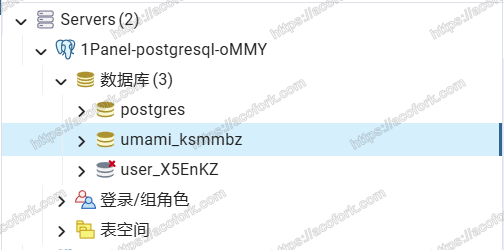

右键需要备份的数据库，点击 **备份**

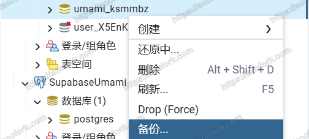

填写 **文件名** 创建备份。备份的文件将会保留在 **pgAdmin4** 上

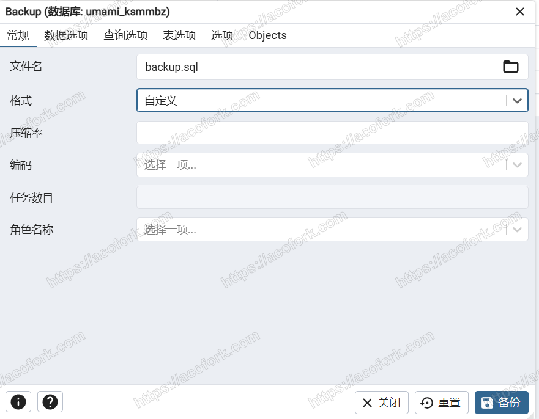

# 还原备份到云端数据库

> 免费计划有 500MB 免费的数据库空间，完全够用了
> 
> 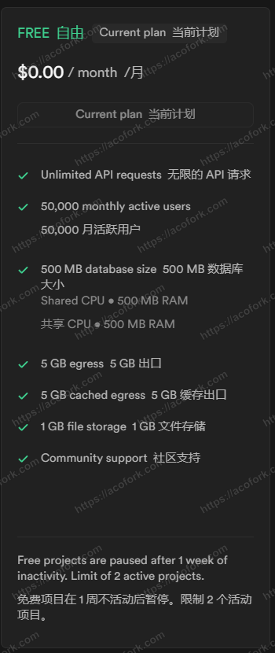

进入 https://supabase.com/

创建一个新项目

找到连接参数（左上角Connect）

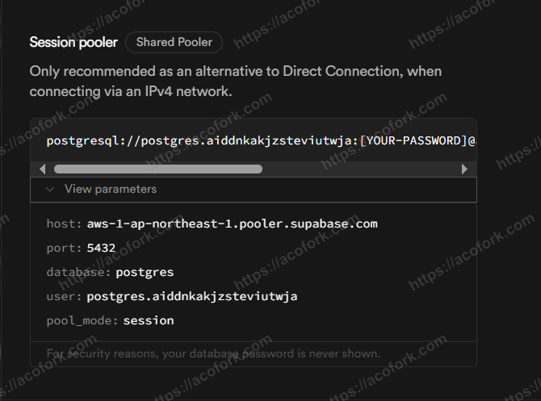

在 **pgAdmin4** 中，连接到Supabase数据库

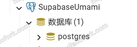

> 值得注意的是，本地的PostgreSQL我们可以创建多个子数据库。而在Supabase中，每一个项目对应一个专属的 **postgres** 数据库。当然，你完全可以使用 **pgAdmin4** 来创建新的子数据库，但是Supabase仪表盘上将不可见。所以，我建议在Supabase项目中，一个项目对应一个数据库，不使用子数据库

右键，进行还原

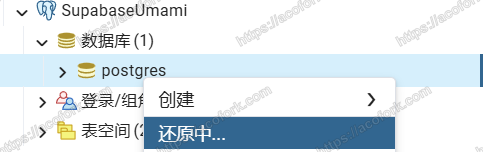

选择刚才备份的数据库文件

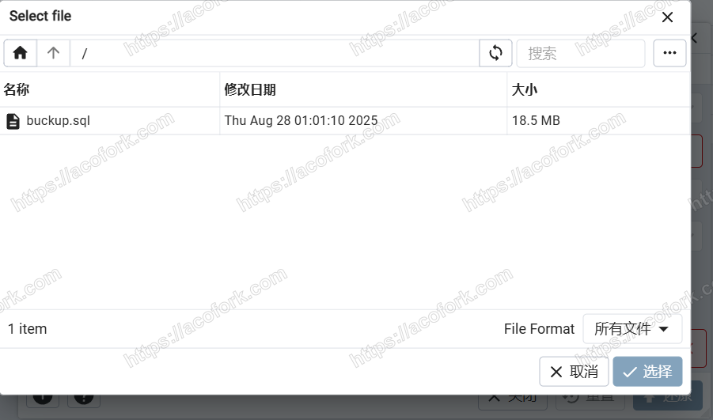

进行还原，必会 **失败**，但是不用管

*这些报错大概就是，找不到之前数据库的用户之类的，实际上表结构已经被还原了*

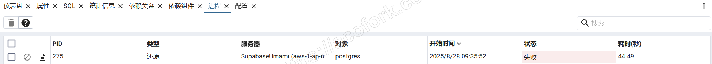

# 在Render上部署Umami

打开 https://dashboard.render.com/

创建项目，选择 **Web Services**

**Source Code** 选择 **Exist Image** ，并输入 `ghcr.io/umami-software/umami:postgresql-v2.19.0` *最好选最新版，也就是 `vx.xx.x` 这个字段*

配置必须的环境变量

| Key           | Value         |
|:-------------:|:-------------:|
| APP_SECRET    | 在之前的环境变量中     |
| DATABASE_TYPE | postgresql    |
| DATABASE_URL  | 在Supabase仪表板中 |

你可以在曾经的Umami实例中看到 **APP_SECRET** 的值

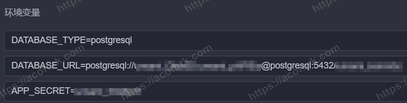

而 **DATABASE_URL** 可以在 Supabase 中看到

其中的 `[YOUR-PASSWORD]` 可以在 Supabase 的数据库设置中进行重置

*注意，Supabase仅支持重置数据库密码，一旦设置后将无法再次查看，请妥善保管您的数据库密码*

配置完毕之后，部署它，Render将会为你分配一个Web地址

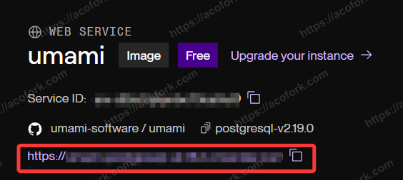

尝试访问，应该已经迁移成功

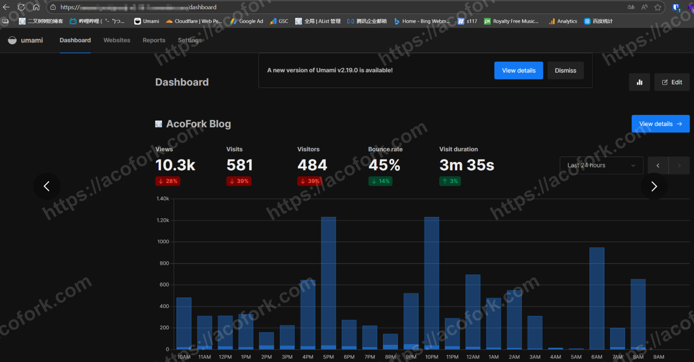

# 配置EdgeOne CDN变相支持CORS配置

> 由于 Umami 没有独立的CORS设置，如果不设置CORS则他人将可以随便刷你的Umami，这会导致统计不准确，详见 [这篇文章](/posts/you-is-me-huh/) 。我们可以接入EdgeOne CDN来变相支持CORS

使用 **源站域名** 作为 **回源 HOST 头** 即可

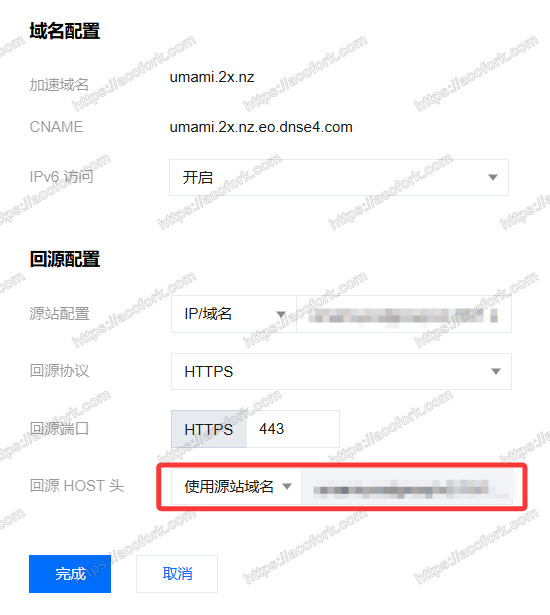

CORS配置详情

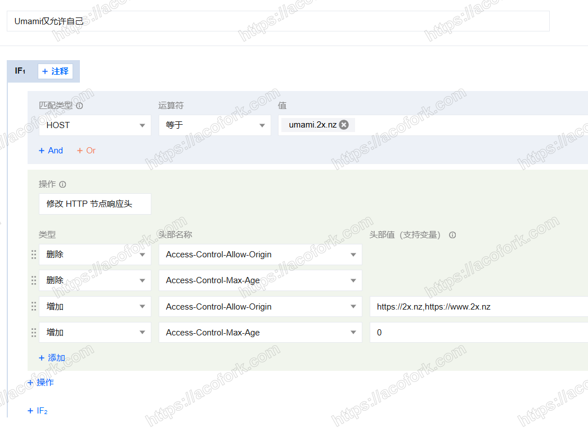
