# 正式开始
首先，我们想要迁移，首先肯定是要拿到原来的Umami Cloud存放的数据

在 [Umami Cloud Data | Settings](https://cloud.umami.is/settings/data) 中，我们可以选择，导出数据（Export）
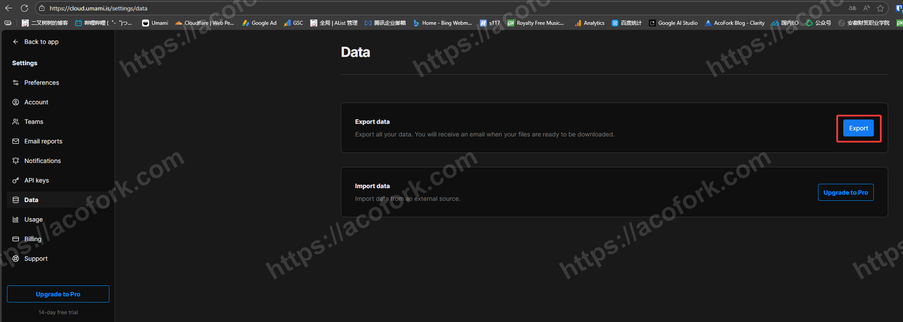

当数据准备好后（几分钟左右），你的邮箱会收到一封Umami Cloud发来的邮件
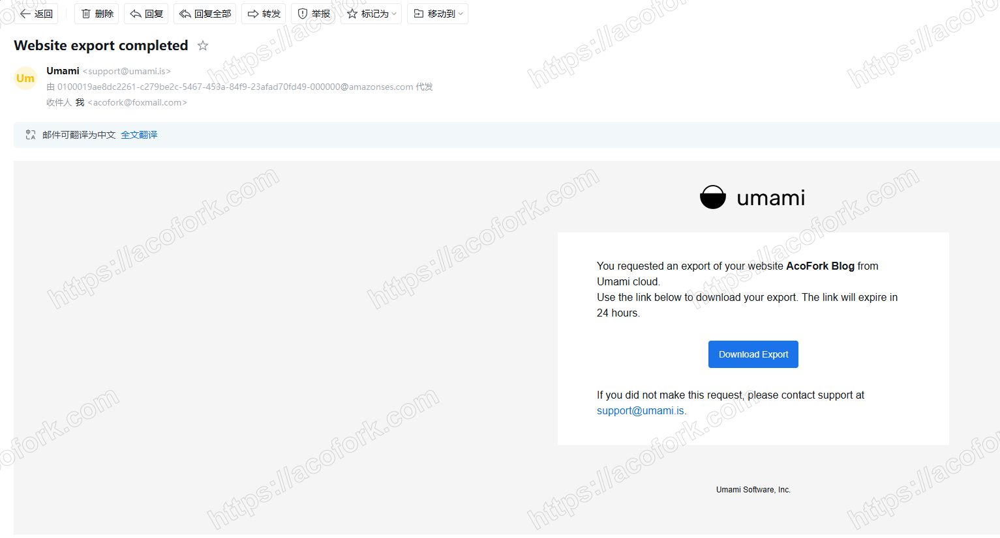

下载下来的文件是一个以UUID命名的ZIP压缩包，将其解压可以得到3个CSV文件
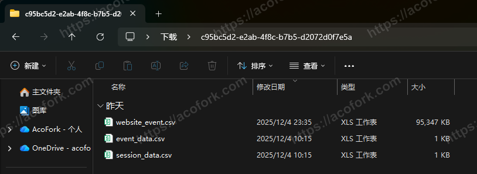

其中，只有 `website_event.csv` 有用，其他两个文件仅有表头，无数据

这样，我们就成功拿到了旧Umami数据

接下来，我们需要在本地部署Umami PostgreSQL版本的 **最新版** （目前版本为 3.x）（部署教程略）

然后我们还需要安装一个CSV编辑软件： [SmoothCSV - The ultimate CSV editor for macOS & Windows](https://smoothcsv.com/)

在本地Umami中新建一个网站，Umami会随机为你生成一个UUID

接下来我们需要在你的终端安装一个图形化管理PostgreSQL的软件： [pgAdmin - PostgreSQL Tools](https://www.pgadmin.org/)

然后连上数据库，你将可以看到这些表
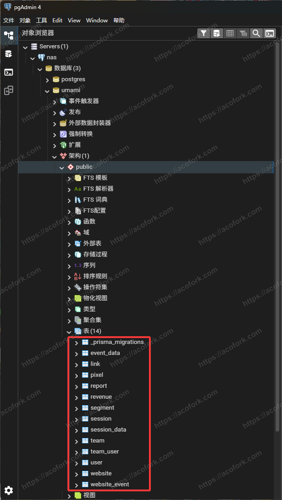

接下来我们查看 `website` 这张表，将 `website_event.csv` 打开，查看旧的 `website_id` 将新的ID改为旧的，这样才能数据匹配
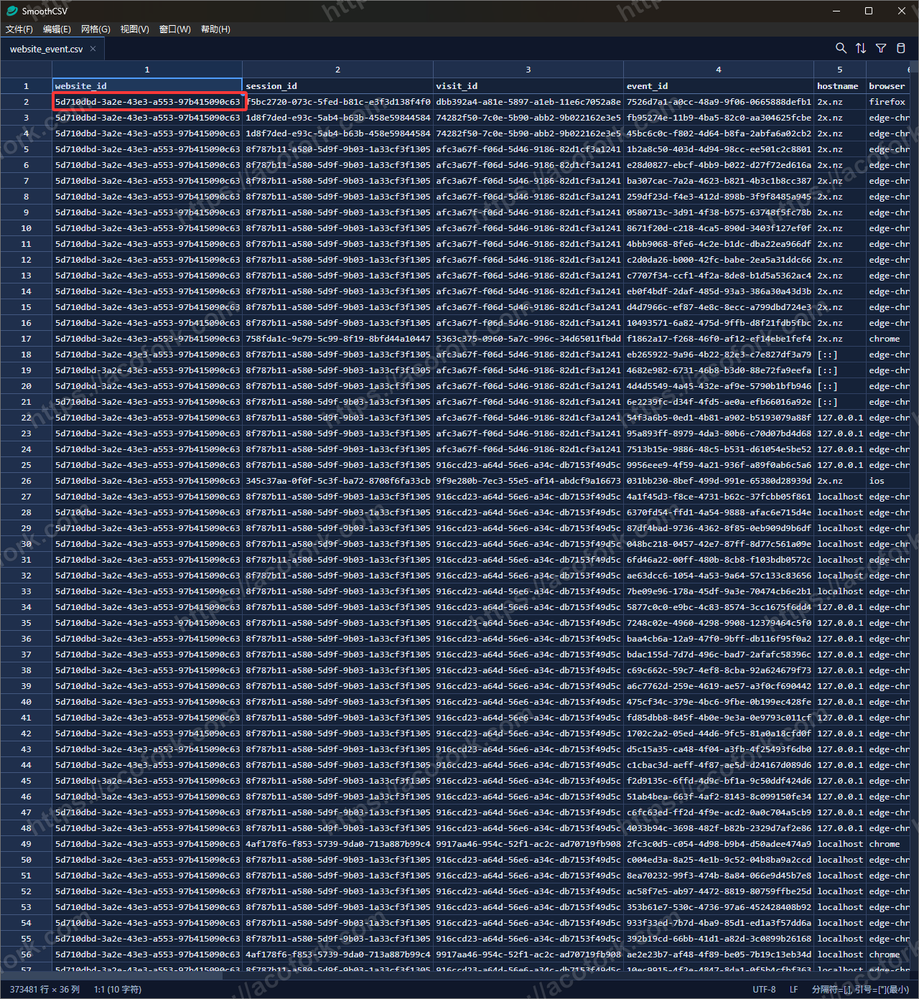
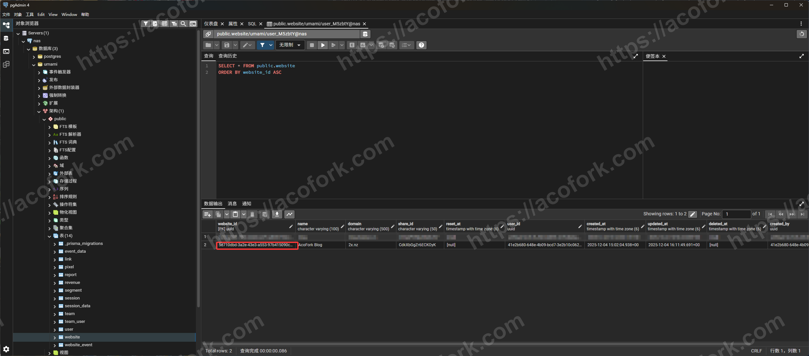

接下来，我们正式开始数据导入，由于导入后的数据有两个 `session_id` 字段，而在Umami自我管理的过程中这个 `session_id` 字段是 **唯一约束的** ，我们需要先解除这个限制，在正式上线前还要再加回这个限制（后面会说）

让我们删除主键约束和索引

```sql
ALTER TABLE session DROP CONSTRAINT session_pkey;
DROP INDEX session_session_id_key;
```

接下来，我们需要将数据配对，我们先查看 `website_event.csv` 这张表。这里应该只有表头，没有数据（我有是因为我已经导入完成了，教程是后写的）

**注意顺序** 如： `event_id` `website_id` `session_id` ...

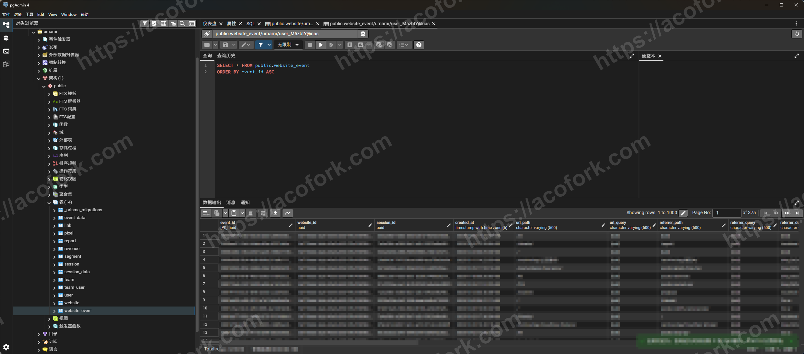

编辑CSV文件，你需要将顺序配对，并且删除表中没有的列，如： `browser` `os` ...
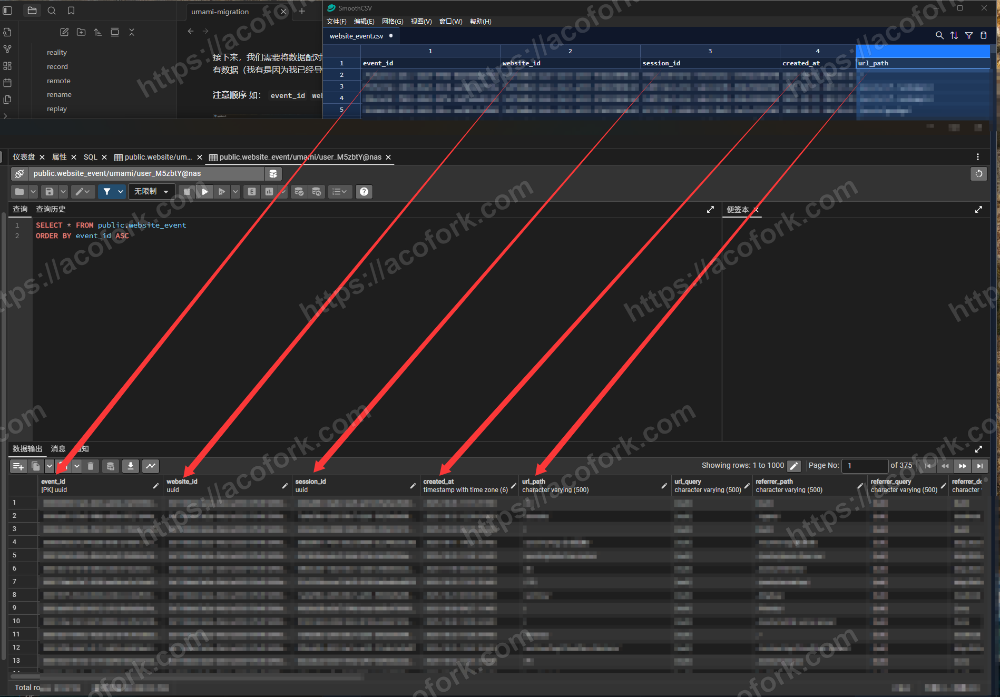

确保数据库中的表头顺序和CSV文件中的表头顺序一一对应，顺序一致，不多不少后，**Ctrl + S 保存** CSV文件，我们开始导入并在选项中勾选 **标题**

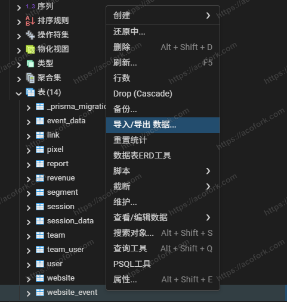


导入成功后如图
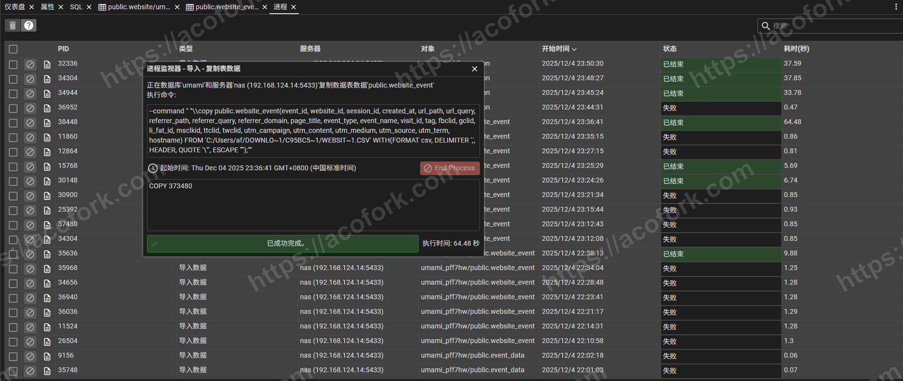
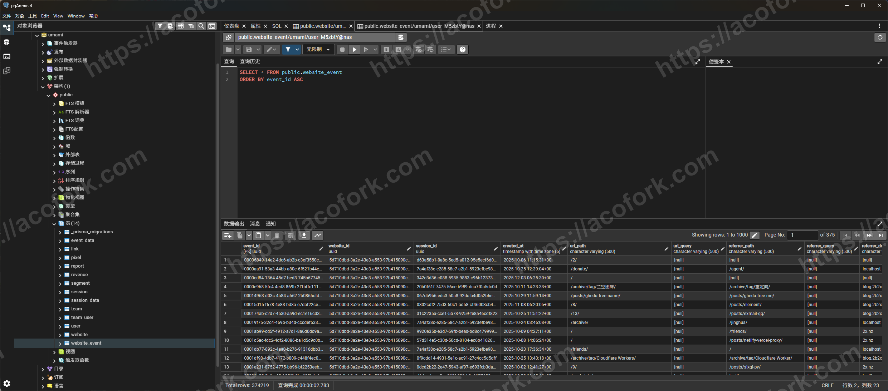

再编辑 `session` 这张表，手法同上，导入成功后如图
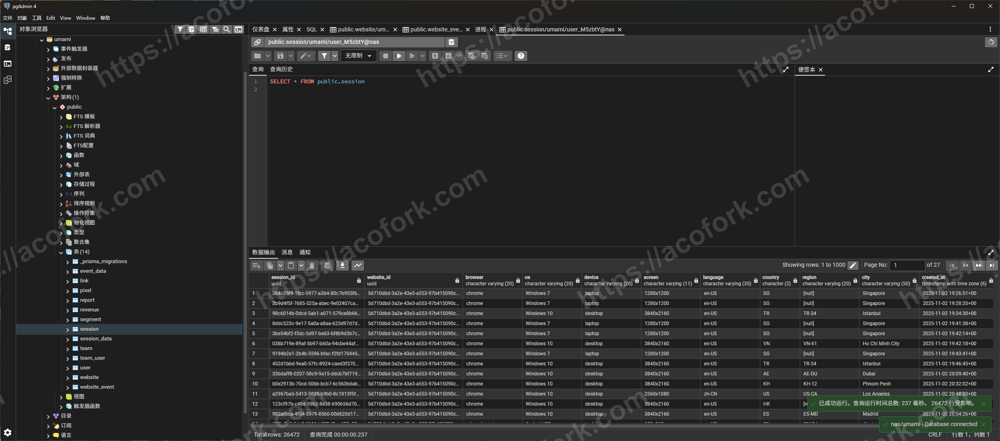

接下来打开本地Umami的WebUI，查看数据是否有异常
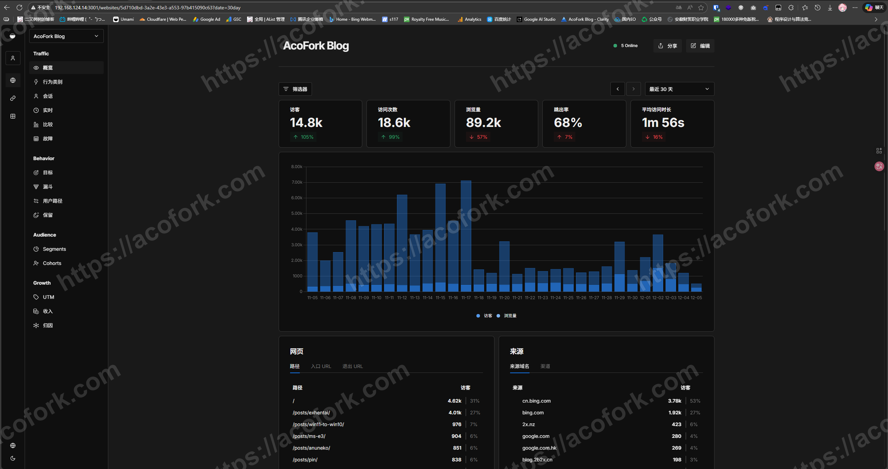

确保导入后数据无异常后，我们开始删除另一条 `session_id` 记录并回锁主键。否则上线后Umami将无法再向表中插入数据
```sql
SELECT session_id, COUNT(*) 
FROM public.session
GROUP BY session_id
HAVING COUNT(*) > 1;

-- 保留最早的 created_at
DELETE FROM public.session
WHERE ctid NOT IN (
    SELECT MIN(ctid)
    FROM public.session
    GROUP BY session_id
);

ALTER TABLE public.session
ADD CONSTRAINT session_id_unique UNIQUE (session_id);
```

至此，迁移工作结束