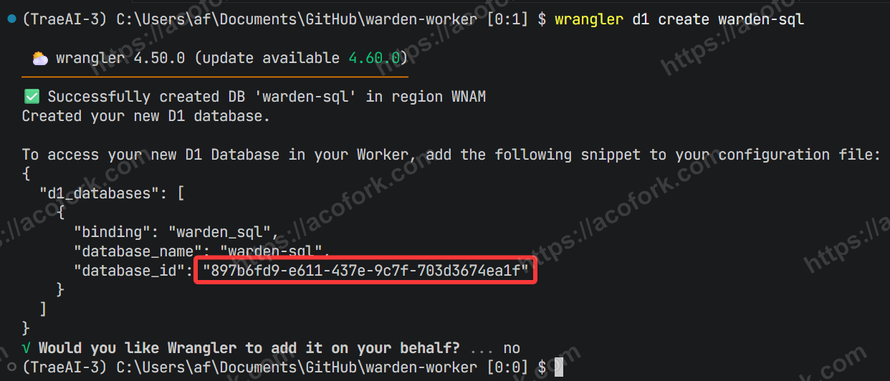
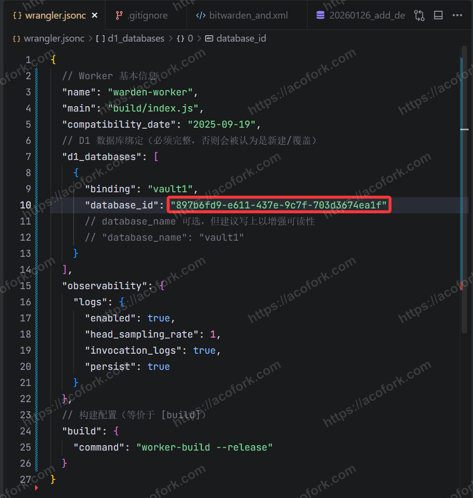
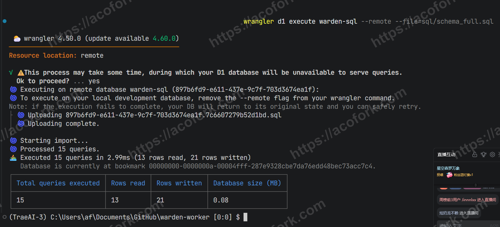
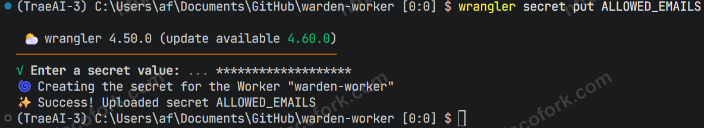
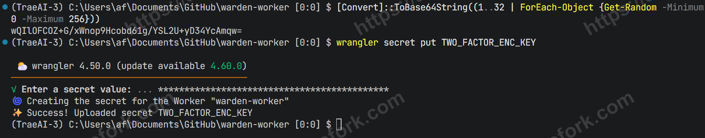
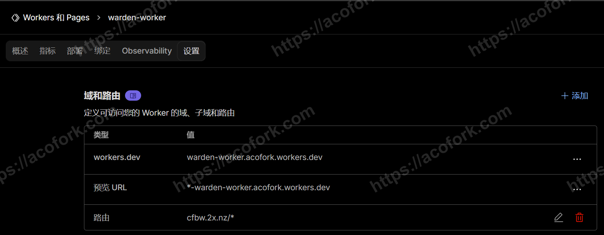
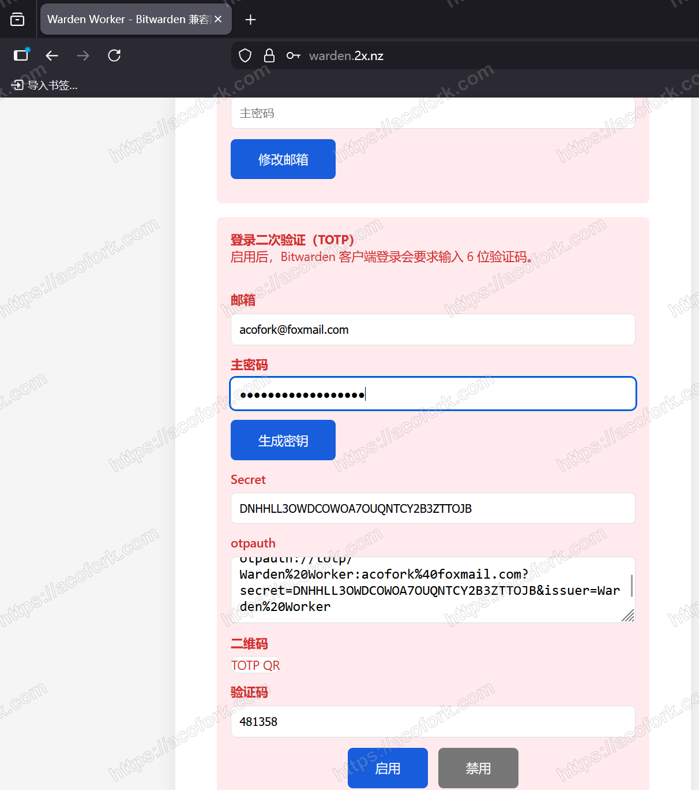
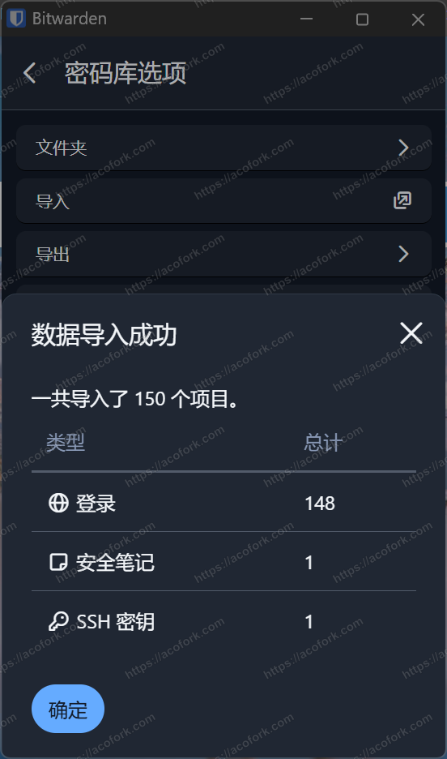

# 原理
项目参考开源的 [dani-garcia/vaultwarden: Unofficial Bitwarden compatible server written in Rust, formerly known as bitwarden_rs](https://github.com/dani-garcia/vaultwarden) 将Rust源码编译为WASM以支持在Cloudflare Worker上运行。其中Worker负责REST API，D1负责存储加密后的数据

# 部署

首先确保你安装了Rust，若无可前往： [安装 Rust - Rust 程序设计语言](https://rust-lang.org/zh-CN/tools/install/)

克隆仓库： [afoim/warden-worker: A Bitwarden-compatible server for Cloudflare Workers](https://github.com/afoim/warden-worker)

创建D1数据库
```sql
wrangler d1 create vault1
```



替换 **wrangler.jsonc** 的数据库ID



初始化数据库

```sql
wrangler d1 execute warden-sql --remote --file=sql/schema_full.sql
```



编译Rust WASM

```bash
cargo build --release
```
部署 Worker

```bash
wrangler deploy
```

设置白名单邮箱

```bash
wrangler secret put ALLOWED_EMAILS
```



设置JWT（脸滚键盘即可）

```bash
wrangler secret put JWT_SECRET
wrangler secret put JWT_REFRESH_SECRET
```


设置2FA加密密钥（32字节Base64编码文本）

```bash
wrangler secret put TWO_FACTOR_ENC_KEY
```

Poweshell可以这样生成

```powershell
[Convert]::ToBase64String((1..32 | ForEach-Object {Get-Random -Minimum 0 -Maximum 256}))
```



前往控制台绑定域名（若路由需要手动写一条解析到Cloudflare）



使用移动端Bitwarden创建账号（使用白名单邮箱）

接下来，前往网页端，启用2FA： https://cfbw.2x.nz （用另一个TOTP验证器存储）

*顺便一提，想要修改邮箱或主密码也可以在网页端进行了*



将所有已登录的设备登出后再登入则会被要求TOTP

# 导入密码库

如果您有旧的密码库，请先前往 **设置 - 密码库选项 - 导出 - .json** 

再登录当前密码库，前往 **设置 - 密码库选项 - 导入 - .json**

