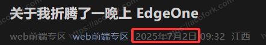
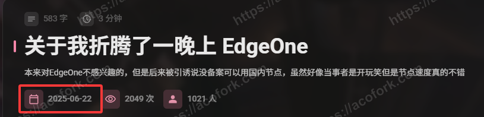
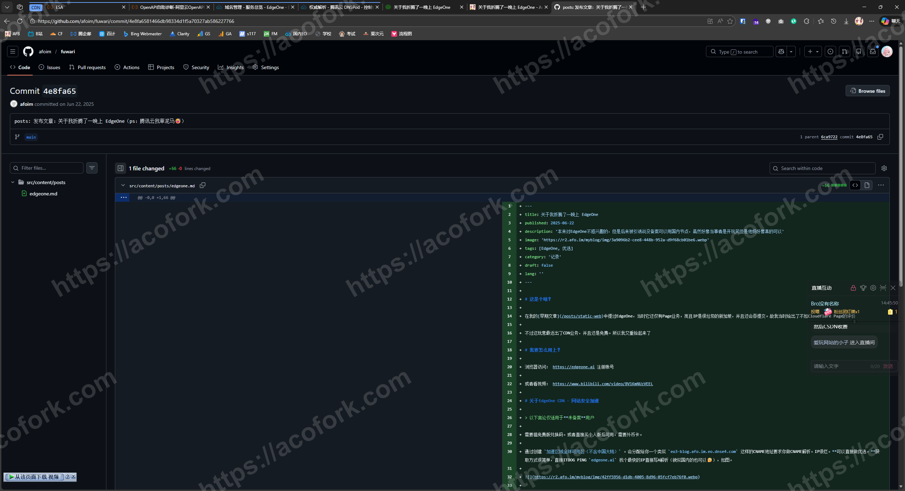
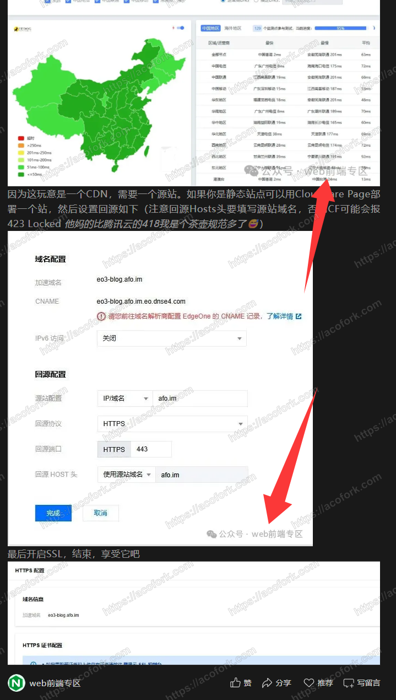
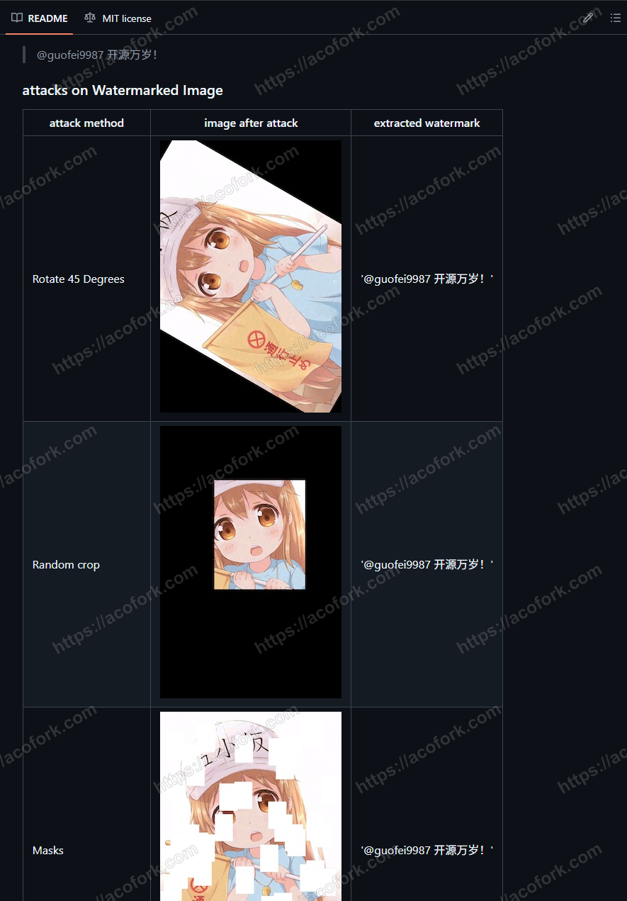

> [!CAUTION]
> 2月4号的2xss你好呀
> 
> 你TM加几把水印呢，还不备份，还Drop并且强制推送远端，还TM给Github发邮件让他们GC
> 
> 你知道老子今天从 `.edgeone` `.astro` 里面找缓存的没水印的原图图片有多几把难吗
> 
> 你真的牛大了，给我桂霞！

# 前言

这是很早之前的事了，简单来说就是有人盗了我的这一篇文章： [关于我折腾了一晚上 EdgeOne - AcoFork Blog](https://acofork.com/posts/edgeone/)

这是他发在微信公众号上的： https://mp.weixin.qq.com/s/F4R6FtJmyHEaKkeMDI6IDw

可以看到，文章纯纯是照搬，而且格式有很多明显错误，并且图片也是用的我的，甚至你还能看到上古域名 **afo.im** 

并且不难发现，它的文章发布日期为

而我的文章发布日期为

有人可能会说，你是静态博客，发布日期只是一串数字，可以随便改，那么我拿出Github当时的提交记录

又有人可能会说了，浏览器中的HTML是可以改的，那么我给出当时的提交URL，你们可以自行查阅： [posts: 发布文章：关于我折腾了一晚上 EdgeOne（ps：腾讯云我草泥马😅） · afoim/fuwari@4e8fa65](https://github.com/afoim/fuwari/commit/4e8fa6581466db98334d1f5a70327ab586227766)

好的，那么至此我应该可以证明我是原作者了

---

其实被盗文章也没啥，我本身也不通过文章来盈利。但是，当我看到我自己拿我自己电脑使用QQ截的图片被发到微信公众号上并默认添加了他的水印，就有点膈应了

我向来视我的文章如老婆，他这样一整就好像我被NTR了一样

那么开始水印战争吧，我要让盗文章的就算盗了，也要让最终读者知道到底是谁做的

# 正式开始

终于又到了我最喜欢的技术环节，那么既然要加水印，我最先想到的就是一个十分古老的LSB水印项目： [guofei9987/blind_watermark: Blind&Invisible Watermark ，图片盲水印，提取水印无须原图！](https://github.com/guofei9987/blind_watermark)

它的原理非常简单，就是对图像做一点很细微的改动，通过改动像素来插入一个编码后的二维码，由于二维码天生抗干扰，再加上一张正常规格的图片像素点非常多，该项目README演示了对添加水印的图片做旋转，缩放，遮挡都可以完整提取出水印

我当场就扒下来看了看用了用，发现并不是很适用

首先就是我的图片在正式在网站中展示前都会被Sharp进行压缩，虽然WEBP是个好格式，它可以大幅缩减图片大小，而质量仅下降一点点。但是对于LSB来说，你对大部分像素完全遮挡不是什么问题，但是WEBP是对整个图像进行压缩，这无疑是对所有像素进行“污染”，实测一旦通过压缩，甚至是简单的重复截图就可以完全破坏水印，而且该项目由于是专注于LSB水印，默认添加的水印也是不可见的，除非你是显微镜，否则文章被盗后甚至是平台默认加个水印，你的水印就不翼而飞了

接下来我就尝试使用传统水印，由于我的博客本身在构建的时候就会使用Sharp进行压缩，Sharp本身也就是一个高效的图像合成库，我就直接拿它将我的域名作为水印覆盖到每一张图上

就像这样： *这里就不配图了，因为按理来说现在全站的文章都有这个神秘的水印*

到这应该就结束了，但是为了严谨，避免别有用心之人跑到Github上面去扒我们的历史提交，我们应当重写仓库历史提交，删除所有图片，然后在这次提交中再提交回来，并且找Github删除孤立的提交与资源文件，详见： [如何让一个文件在Git提交中永远消失？如何丢掉其中一条提交并保持逻辑完整？ - AcoFork Blog](/posts/del-git-commit/)

至此，应该再无任何人能得到无水印的原图了，只要我不再写完新文章后忘记运行加水印的脚本，结束

# 题外话

让文章不被盗是不可能的，对于文本内容，几乎无计可施，因为别有用心之人仅需爬RSS即可获取你的文章，但是对于图片，我们也只有加水印这一种方式，虽然这会让原本干净的图片变得有点遭