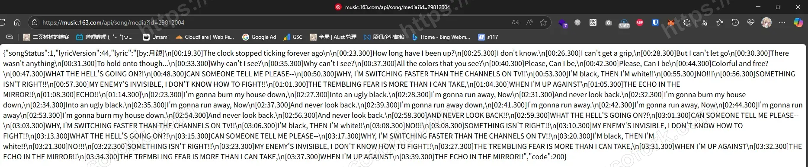

# 正式开始

首先我们要获取一首歌的ID，如果你是App可以点击分享，然后 `复制链接` 。如果是Web，直接复制浏览器地址栏

你将得到类似这样的URL

`https://music.163.com/#/song?id=29812004&uct2=U2FsdGVkX1+0Ic0zSL7yd7aZMm+xya0r1rUmiRUO5Us=`

其中的 `id=29812004` 中的值就是我们的歌曲ID

接下来拼接URL

```bash
https://music.163.com/api/song/media?id=29812004
```

访问就得到歌词时间戳啦

```bash
{"songStatus":1,"lyricVersion":44,"lyric":"[by:月餖]\n[00:19.30]The clock stopped ticking forever ago\n\n[00:23.300]How long have I been up?\n[00:25.300]I don't know.\n[00:26.300]I can't get a grip,\n[00:28.300]But I can't let go\n[00:30.300]There wasn't anything\n[00:31.300]To hold onto though...\n[00:33.300]Why can't I see?\n[00:35.300]Why can't I see?\n[00:37.300]All the colors that you see?\n[00:40.300]Please, Can I be,\n[00:42.300]Please, Can I be\n[00:44.300]Colorful and free?\n[00:47.300]WHAT THE HELL'S GOING ON?!\n[00:48.300]CAN SOMEONE TELL ME PLEASE--\n[00:50.300]WHY, I'M SWITCHING FASTER THAN THE CHANNELS ON TV!!\n[00:53.300]I'M black, THEN I'M white!!\n[00:55.300]NO!!!\n[00:56.300]SOMETHING ISN'T RIGHT!!\n[00:57.300]MY ENEMY'S INVISIBLE, I DON'T KNOW HOW TO FIGHT!!\n[01:01.300]THE TREMBLING FEAR IS MORE THAN I CAN TAKE,\n[01:04.300]WHEN I'M UP AGAINST\n[01:05.300]THE ECHO IN THE MIRROR!!\n[01:08.300]ECHO!!\n[01:14.300]\n[02:23.300]I'm gonna burn my house down,\n[02:27.300]Into an ugly black.\n[02:28.300]I'm gonna run away, Now\n[02:31.300]And never look back.\n[02:32.300]I'm gonna burn my house down,\n[02:34.300]Into an ugly black.\n[02:35.300]I'm gonna run away, Now\n[02:37.300]And never look back.\n[02:39.300]I'm gonna run away down,\n[02:41.300]I'm gonna run away.\n[02:42.300]I'm gonna run away, Now\n[02:44.300]I'm gonna run away\n[02:53.300]I'm gonna burn my house down.\n[02:54.300]And never look back.\n[02:56.300]And never look back.\n[02:58.300]AND NEVER LOOK BACK!!\n[02:59.300]WHAT THE HELL'S GOING ON?!\n[03:01.300]CAN SOMEONE TELL ME PLEASE--\n[03:03.300]WHY, I'M SWITCHING FASTER THAN THE CHANNELS ON TV!!\n[03:06.300]I'M black, THEN I'M white!!\n[03:08.300]NO!!!\n[03:08.300]SOMETHING ISN'T RIGHT!!\n[03:10.300]MY ENEMY'S INVISIBLE, I DON'T KNOW HOW TO FIGHT!!\n[03:13.300]WHAT THE HELL'S GOING ON?!\n[03:15.300]CAN SOMEONE TELL ME PLEASE--\n[03:17.300]WHY, I'M SWITCHING FASTER THAN THE CHANNELS ON TV!!\n[03:20.300]I'M black, THEN I'M white!!\n[03:21.300]NO!!!\n[03:22.300]SOMETHING ISN'T RIGHT!!\n[03:23.300]MY ENEMY'S INVISIBLE, I DON'T KNOW HOW TO FIGHT!!\n[03:27.300]THE TREMBLING FEAR IS MORE THAN I CAN TAKE,\n[03:31.300]WHEN I'M UP AGAINST\n[03:32.300]THE ECHO IN THE MIRROR!!\n[03:34.300]THE TREMBLING FEAR IS MORE THAN I CAN TAKE,\n[03:37.300]WHEN I'M UP AGAINST\n[03:39.300]THE ECHO IN THE MIRROR!!","code":200}
```


